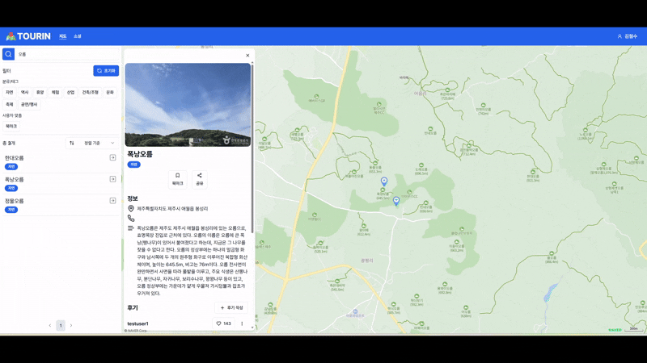

# TOURIN


관광지를 검색 및 조회하고 공유할 수 있는 커뮤니티 서비스.

- 목차
  - 프로젝트 구조
  - 기술 스택
  - 서비스 대표 기능

# 프로젝트 구조
```
(root)
  ├─ frontend: 프로젝트 프론트엔드
  ├─ backend: 프로젝트 백엔드
  ├─ data: 프로젝트 데이터/AI/ML
  └─ document: 프로젝트 문서(설계 문서, issue 관련 회고)
```
- `/document/issue`에서 프로젝트를 진행하며 해결한 이슈를 자세히 확인하실 수 있습니다

# 기술 스택


## 프론트엔드
- React
- Vite
- tailwind css
- shadcn/ui

적은 구현으로 예쁜 UI를 만들기 위해 shadcn/ui를 사용해 봤습니다. 또한 일관된 스타일링을 위해 tailwind css를 사용했습니다.

## 백엔드
- Spring Boot
- Spring Data JPA
- MySQL

서버 앱 프레임워크로 Flask를 사용해 본 적이 있습니다. Flask의 경우 경량 프레임워크이기 때문에 직접 구현해야하는 부분이 많아 번거로운 부분이 많았습니다. 최근 Spring과 Spring MVC를 공부하면서 객체지향 웹 프레임워크의 Best Practice를 보는 것 같다는 생각을 하게 되었고 매력적으로 느껴졌습니다. 따라서 이번 프로젝트에서는 Spring을 사용해 봤습니다. Spring Data JPA의 경우, 엔티티만 구현하면 DAO를 자동으로 만들어주기 때문에 구현 부담을 줄이기 위해 사용했습니다.

## 그 외
- Postman
- MSW
- OpenAPI

프론트엔드와 서버를 분리해 독립적으로 테스트하기 위해 Postman과 MSW를 사용했습니다. 또한 OpenAPI spec을 기준으로 API 명세를 작성했습니다.

# 서비스 대표 기능
## 관광지 검색 및 조회

- 여러 태그(이름, 태그)에 맞는 관광지를 검색할 수 있습니다
- 검색된 관광지를 목록 형태로 또는 지도 상에서 확인할 수 있습니다

## 관광지 북마크

- 관광지를 북마크에 추가/삭제할 수 있습니다

## 관광지 공유

- 관광지를 공유하고 싶다면 "공유" 버튼을 눌러 링크를 클립보드에 복사합니다
- 링크를 주소창에 입력하면 해당 관광지 페이지로 이동합니다

## 관광지 후기 조회/등록/삭제

- 관광지에 대한 후기를 조회할 수 있습니다
- 관광지에 대한 후기를 남기거나 삭제할 수 있습니다
- 관광지에 대한 후기를 공감(또는 좋아요)할 수 있습니다

## 회원 조회

- 궁금한 다른 회원에 정보를 조회할 수 있습니다
- 회원이 북마크한 관광지를 조회할 수 있습니다