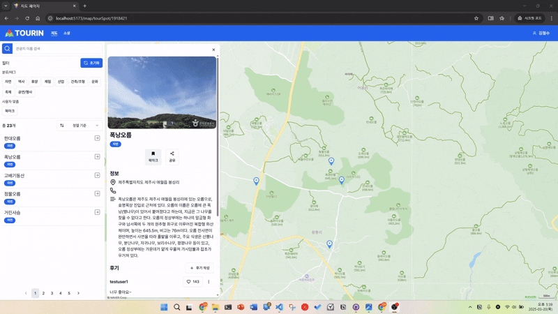

# URL을 이용한 관광지 공유
## 배경
- [기능 요구사항](../기능적%20요구사항.md)에 "관광지 공유" 기능 존재
  - URL을 이용해 관광지를 공유하는 기능
  - 페이지 상태에 따라 URL 변경
  - 브라우저에 URL을 입력하면 관광지가 포커스된 페이지 출력

## 페이지 새로고침이 없는 URL 변경이 필요하다
인터넷에서 제공되는 지도 서비스에서 장소에 대한 상세정보를 조회하면 페이지 새로고침 없이 URL만 바뀌는 모습을 볼 수 있습니다. 그리고 해당 URL을 복사해 공유하면, 내가 보던 페이지를 그대로 남들에게 공유할 수 있습니다.

SPA는 기본적으로 하나의 페이지에서 동작하기 때문에 일반적인 구현으로는 URL을 잘 활용하지 못합니다. URL이 바뀔 때마다 페이지의 상태가 초기화되기 때문입니다. TOURIN은 지도를 활용한 커뮤니티 서비스입니다. 따라서 URL을 활용한 공유 기능이 존재하고, 다른 지도 서비스들과 마찬가지로 새로고침 없는 URL 변경이 필요했습니다.

## `useUrl` 커스텀 훅 정의
페이지 새로고침 없는 URL 변경과 URL을 이용한 페이지 공유를 위해 `useUrl` 커스텀 훅을 구현했습니다. 이 훅들을 이용해 URL 데이터에 접근하고 URL을 변경할 수 있습니다.

- `useUrlSearchParam`: URL의 search parameter를 관리하고 사용하는 커스텀 훅
- `useUrlPathParam`: URL의 path paramter를 관리하고 사용하는 커스텀 훅
  - 주어진 URL 패턴을 이용해 URL 파싱
- 그 외...

위 커스텀 훅들은 페이지 새로고침 없이 URL을 변경하기 위해 History API를 사용하고, URL 변경에 반응하기 위해 커스텀 이벤트와 `useSyncExternalStore` 훅을 이용합니다.

### History API 활용
페이지 새로고침 없이 URL을 바꾸기 위해서는 브라우저의 [History API](https://developer.mozilla.org/en-US/docs/Web/API/History_API)를 사용해야 합니다. `history.pushState` 함수를 이용해 페이지 새로고침 없이 URL을 바꿀 수 있습니다.

### `useSyncExternalStore` 훅을 이용한 상태 연동
History API를 이용해 URL을 바꾸면, 앱에서는 바뀐 URL을 활용해 페이지를 렌더링하면 됩니다. 브라우저의 `location` 객체를 참조해 URL를 조회할 수 있습니다.

React 앱은 사용자와의 상호작용으로 URL을 변경하고, 변경된 URL에 따라 컴포넌트를 재랜더링해야 합니다. 이를 위해서는 React 시스템이 URL과 연계되어야 합니다. React의 재랜더링은 훅과 함께 제공되는 상태 dispatcher 함수에 의해 촉발됩니다. 따라서 일반적으로는 React 외부에서 정의된 상태에 대한 변경을 감지하지 못합니다. 하지만 이와 같은 경우를 위해 `useSyncExternalStore` 훅을 제공하고 있습니다. 이 훅을 이용한다면 외부 데이터에 구독해 그것의 변경에 맞춰 컴포넌트를 재랜더링 할 수 있습니다.

여기서 문제는 URL 변경을 감지할만한 이벤트가 없다는 것입니다. History API의 `popstate` 이벤트가 존재하지만, 이 이벤트는 페이지 뒤로가기/앞으로 가기를 할 때만 발생하는 이벤트입니다. 앱에 의한 URL 변경을 확실히 감지하기 위해서는 `history.pushState` 함수를 호출할 때마다 이벤트가 발생해야 합니다. 따라서 `useUrl` 커스텀 훅에서는 아래와 같이 문제를 해결했습니다.

```javascript
// setter
const setter = React.useCallback(
    (...) => {
        ...
        window.history.pushState(...); // URL 변경
        window.dispatchEvent(new Event('changeurl')); // 커스텀 이벤트 발생
    }, [...]
);
```

`useUrl` 훅에서는 URL 데이터(search parameter, path parameter)와 함께 그것을 변경할 수 있는 setter를 제공하고 있습니다. React 컴포넌트는 이 setter를 이용해 URL 데이터를 변경할 수 있습니다. setter 내부에서 `history.pushState`로 URL을 변경하면, 커스텀 이벤트(`changeurl`)를 발생시킵니다. `useSyncExternalStore` 훅으로 이벤트를 구독하면 URL 변경을 감지할 수 있게 됩니다.

결과적으로, URL이 변경되면 커스텀 이벤트(`changeurl`)이 발생하고, `useSyncExternalStore` 훅이 그것을 감지해 변경된 URL에 맞게 컴포넌트가 재랜더링 됩니다.

## 완성 결과




페이지 새로고침 없이 URL이 바뀌고, 관광지 URL을 입력하면 관광지에 대한 정보가 출력되는 것을 확인하실 수 있습니다.

## 향후 개선 방향
"URL을 이용한 관광지 공유" 이슈를 해결하는 과정으로 React와 외부 시스템의 연계에 대해서 고민해 볼 수 있었고, History API에 대해 공부해 볼 수 있었습니다.

하지만 이미 구현을 다 한 후에 알게 된 사실이지만 기능 구현에 딱 맞는 라이브러리가 이미 존재합니다. [React Router](https://reactrouter.com/)는 제가 필요했던 기능을 모두 제공하면서 인터페이스도 훨씬 깔끔합니다. 저보다 경험이 많은 사람들이 기여한 프로젝트이기 때문에 더 신뢰할 수 있습니다. 따라서 개발한 커스텀 훅에 대한 의존이 늘어나기 전에 해당 라이브러리로 바꿀 것을 계획하고 있습니다.

## 참조
- [`use-url.ts`](https://github.com/positiveWand/project-trip-sns/blob/main/frontend/src/hooks/use-url.ts) - `useUrl` 커스텀 훅