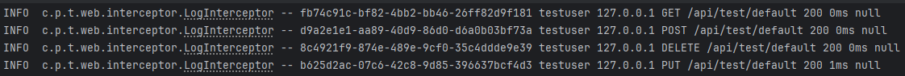

# 모니터링, 디버깅을 위한 로그 남기기
## 배경
앱을 개발하면서 문제점이 발견되면, 문제 상황을 쉽게 재현해 디버거로 앱의 상태를 추적하여 원인을 파악할 수 있습니다. 하지만 실제 배포된 서비스에는 디버거를 사용하기 쉽지 않습니다. 설령 가능하더라도 상황(동시성 로직 등)에 따라 디버거만으로는 상태 추적이 힘들 수도 있습니다. 따라서 로그가 필요합니다. 이 글에서는 로그가 필요한 이유, 로그가 남겨질 시점 그리고 로그에 담겨야할 정보에 대한 생각과 이를 프로젝트에 적용한 과정에서의 고민을 정리한 글입니다.

## Why? - 로그가 필요한 이유
로그를 무작정 남기기보다는 왜 남기는지에 대해서 짚고 넘어가봅시다. 로그는 왜 필요할까요? ChatGPT에 물어보니 대표적으로 아래의 이유가 있다고 합니다.

- **문제 추적 및 디버깅**: 오류가 발생했을 때, 무슨 상황에서 어떤 입력이 들어왔고 어떤 흐름으로 코드가 실행되었는지 확인하기 위함
- **모니터링과 안정성 확보**: 시스템이 정상적으로 동작하는지 감시하기 위함
- **보안 및 감사**: 누가 언제 어떤 요청을 했는지 기록해 접근 제어 및 보안 위반 탐지에 활용하기 위함
- **성능 분석 및 최적화**: 요청 처리 시간을 기록해 병목 지점을 파악하기 위함
- **사용자 행동 분석**: 단순 시스템 운영을 넘어 비즈니스 인사이트를 발굴하기 위함

내용은 그럴 듯해보이며 실제 구글에 검색해보아도 비슷한 이유로 로그를 남긴다고 합니다. 정리하자면 로그를 남기는 이유는 결국 "기록"을 남기기 위해서 입니다. 이미 지나간 이벤트에 대해서 자세히 알고 싶은데 타임머신을 돌릴 수는 없으니 기록을 남기는 겁니다.

하지만 무작정 매순간, 모든 상태를 기록하는 것은 바람직하지 않습니다. 결국 자원은 한정적이기 때문에 로그를 남기는 시점과 기록하는 정보 또한 한정적일 수밖에 없습니다. 그리고 그 한계는 현재 또는 미래의 구체적인 필요에 의해 결정될 것입니다.

위에 제시된 이유 중 저의 관심사는 "문제 추적 및 디버깅", "모니터링과 안정성 확보", "성능 분석 및 최적화"입니다. 로그를 이용해 쉽게 디버깅하고 싶고, 모니터링 환경을 구성해 운영을 간단히 경험해보고 싶습니다. 이를 정해놓고 이야기를 이어나가도록 하겠습니다.

## When? & What? - 언제, 어떤 정보를 로그에 남겨야할까
로그는 언제 남겨야할까요? 아무래도 고정된 시점보다는 관심 있는 이벤트가 발생한 시점에 남기는 것이 제일 바람직해보입니다. 로그에 이벤트 발생 시간이 함께 담겨야 시간 흐름에 따라 추적 및 분석하기 용이해지기 때문입니다.

그럼 로그에는 어떤 정보가 있어야할까요? 로그를 남길 때마다 앱의 모든 상태를 남기는 것은 비효율적입니다. 따라서 로그를 남기는 이유에 맞춰서 남길 정보를 적절히 선택해야합니다. 앞서 언급했다시피 저는 디버깅과 성능 분석, 모니터링에 로그를 활용하고 싶습니다. 따라서 이에 맞춰서 필요한 정보를 로그에 남기면 됩니다. 당연히 더 세밀하고 자세하게 로그를 남길 수도 있지만 일단은 아래 정도 수준의 로그를 남기기로 결정했습니다.

- HTTP 요청 처리 결과 로그([참고 - Amazon S3 Access Log](https://docs.aws.amazon.com/ko_kr/AmazonS3/latest/userguide/LogFormat.html))
  - 원격 IP
  - HTTP 메소드
  - URI
  - HTTP 상태코드
  - 반환 시간
  - User-Agent
  - (응답 상태코드가 500번대인 경우) 예외 stack trace
- 메소드 호출 로그
  - 호출 매개변수
  - 반환 값
  - (예외가 발생한 경우) 예외 stack trace
  - 반환 시간
- 공통 정보
  - Trace ID: 요청마다 부여되는 식별자
  - User ID: 사용자 식별자, 식별되지 않은 경우 anonymous

## How? - 어떻게 로그를 남길까
### 로깅 프레임워크
Java 진영에서는 대표적으로 `log4j`, `logback`과 같은 로깅 프레임워크를 사용합니다. 이들은 사용이 편리하면서 성능까지 우수하기 때문에 특별한 이유가 없다면 그대로 사용하는 것이 좋습니다. 특히 Spring Boot에서는 `logback`을 기본 로거로 채택하고 있기 때문에 `logback`을 사용했습니다.

### 로깅 코드는 어디에?
로그는 이벤트 발생 시점에 남겨져야 하기 때문에 다른 일반 로직과 섞이기 쉽습니다. 하지만 이럴 경우 코드가 난잡해지거나 중복된 코드가 발생하기 쉽습니다. 따라서 어쩔 수 없는 경우를 제외하고는 일반 로직과 분리해서 로그 코드를 작성해주는 것이 유지보수 측면에서 좋습니다. 저는 로그 코드를 작성하기 위한 위치로 서블릿 필터, Spring MVC 인터셉터, Spring AOP를 고려했고, 결과적으로 Spring MVC 인터셉터, Spring AOP를 이용해 로깅을 구현했습니다.

"HTTP 요청 처리 결과 로그"는 Spring 인터셉터를 이용해 구현했습니다. 서블릿 필터를 이용해 로깅할 수도 있지만 아래의 이유 때문에 인터셉터를 이용해 구현했습니다.

- **Spring Application Context 접근 용이**: 로그에 필요한 정보가 Application Context에 담긴 경우가 있습니다. 서블릿 필터에서도 가능하지만 인터셉터에서 Spring Application Context에 접근하기 훨씬 용이합니다.
- **모든 서블릿 필터를 지난 후 처리**: 인증/인가 등의 사전 처리가 서블릿 필터에서 이미 이뤄진 후의 요청들만을 필터링해서 로깅할 수 있습니다. 이미 걸러진 요청들을 로깅한다는 것은 어찌보면 단점이지만, 걸러진 요청들에는 관심이 없어 인터셉터만으로 충분하다고 생각했습니다.

인터셉터의 `preHandle` 메소드에서는 이후 로그들에서 사용할 수 있도록 Trace ID와 User ID를 MDC에 저장하고, `afterCompletion` 메소드에서는 요청 처리 결과 로그를 남기도록 구현했습니다.

```java
@Override
public boolean preHandle(HttpServletRequest request, HttpServletResponse response, Object handler) throws Exception {
    requestStartTime.set(System.currentTimeMillis());
    CustomUserDetails user = customUserDetailsService.getCurrentContextUser();

    MDC.put("traceId", UUID.randomUUID().toString());
    MDC.put("user", user != null ? user.getUsername() : null);

    return true;
}

@Override
public void afterCompletion(HttpServletRequest request, HttpServletResponse response, Object handler, Exception ex) throws Exception {
    // 요청 로그
    long duration = (requestStartTime.get() != null) ? (System.currentTimeMillis() - requestStartTime.get()) : -1;

    log.info("{} {} {} {} {}ms {}",
            value("remoteIp", request.getRemoteAddr()),
            value("httpMethod", request.getMethod()),
            value("uri", request.getRequestURI()),
            value("httpStatus", response.getStatus()),
            value("duration", duration),
            value("userAgent", request.getHeader("User-Agent") != null ?
                    "\"" + request.getHeader("User-Agent") + "\"" :
                    null
            )
    );

    MDC.clear();
}
```

그리하여 아래와 같은 형태의 로그가 남습니다.



하지만 인터셉터만을 사용할 경우 문제가 있습니다. 알 수 없는 예외로 500번대 응답이 발생한 경우, ControllerAdvice에서 예외가 처리되고 `afterCompletion` 메소드에 예외가 전달되지 않는다는 것입니다. 500번대 응답이 발생한 원인을 함께 기록하지 못합니다. 따라서 이 경우에는 아래와 같이 ControllerAdvice에서 로그를 남기도록 구현했습니다.

```java
@ExceptionHandler
public ResponseEntity<ErrorResponse> handleUnknownException(Throwable e) {
    log.error("{}", e.getMessage(), e);
    return new ResponseEntity<>(new ErrorResponse("알 수 없는 서버 오류", "서버에서 알 수 없는 이유로 요청 처리에 실패했습니다."), HttpStatus.INTERNAL_SERVER_ERROR);
}
```

"메소드 호출 로그"는 Spring AOP를 이용해 구현했습니다. 관심 있는 메소드들을 포인트컷으로 지정하고 호출과 반환 시 로그가 남도록 구현했습니다. 이때 "메소드 호출 로그"는 디버깅 목적의 로그이므로 로그 레벨을 `DEBUG`로 지정했습니다.

```java
@Around("execution(* com.positivewand.tourin..*Controller.*(..)) || execution(* com.positivewand.tourin..*Service.*(..))")
public Object traceMethodCall(ProceedingJoinPoint joinPoint) throws Throwable {
    long callTime = System.currentTimeMillis();
    long returnTime;
    try {
        log.trace("메소드 진입(CALL_TIME+0ms) - {} args={}", joinPoint.getSignature(), joinPoint.getArgs());
        Object result = joinPoint.proceed();
        returnTime = System.currentTimeMillis();
        log.trace("메소드 탈출(CALL_TIME+{}ms) - {} return={}", returnTime-callTime, joinPoint.getSignature(), result);

        return result;
    } catch(Throwable e) {
        returnTime = System.currentTimeMillis();
        if(log.isTraceEnabled())
            log.error("메소드 예외(CALL_TIME+{}ms) - {}", returnTime-callTime, joinPoint.getSignature(), e);

        throw e;
    }
}
```

## 향후 계획
이것으로 로그의 필요성, 그것을 남기는 시점과 남길 정보에 대해 고민해볼 수 있었습니다. 그리고 인터셉터와 AOP를 이용해 로그 관련 관심사를 분리 구현해 코드의 유지보수성을 높였습니다.

하지만 이것만으로 로그를 운영에 활용하기에는 부족합니다. 현재까지는 로그가 콘솔에 출력되고 말기 때문입니다. 사람이 하루종일 콘솔 화면을 쳐다볼 수는 없기 때문에 파일 또는 별도의 저장소에 로그를 저장할 필요가 있습니다. 또한 문제가 발생하면 알림을 주고, 쉽게 서비스 상태를 모니터링할 수 있도록 중요한 정보를 시각화해주는 시스템이 필요합니다. 다음으로는 로그 수집, 집계 및 시각화 시스템을 구축해보도록 하겠습니다.