# 좋아요 수 조회 및 쓰기 최적화

## 배경

- 참고 - [기능적 요구사항](../기능적%20요구사항.md)
  - TOURIN 사용자는 관광지를 검색하고 관광지에 대한 후기를 남길 수 있음
  - TOURIN 사용자는 관광지 후기를 공감하거나 공감 취소할 수 있음
- 관광지 후기 공감(또는 좋아요) 수를 조회하기 위해 SQL COUNT 쿼리를 사용

## COUNT 쿼리의 문제점

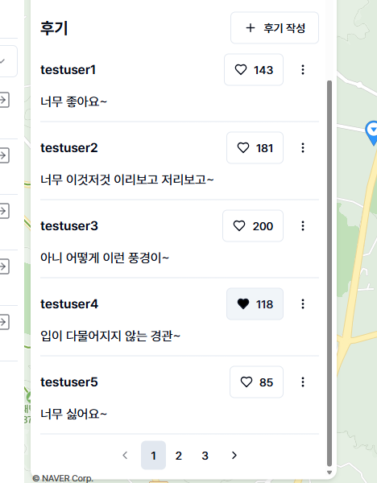

TOURIN에서는 관광지 후기의 "좋아요 수"를 통해 얼마나 많은 사람이 후기에 공감했는지 확인할 수 있습니다. 그리고 "좋아요 수"를 조회하기 위해서 SQL COUNT 쿼리를 이용했습니다. [이 글](https://stackoverflow.com/questions/3044898/how-does-sql-count-work)을 보면 알 수 있듯이 SQL COUNT 쿼리는 조건에 해당하는 행을 모두 조회한 후 일일이 개수를 세는 방식으로 동작합니다. 이런 방법은 데이터가 적거나 요청 자체가 자주 발생하지 않는 환경에서 적합합니다. 하지만 TOURIN에서 "좋아요 수"는 기대 시나리오 상 조회 및 변경이 잦습니다.

실제로 데이터 증가에 따라 문제가 발생함을 확인해보기 위해 아래와 같이 테스트를 진행해봤습니다. Postman을 이용해 부하테스트를 진행해 조회 성능을 측정했습니다.

- 1분간 가상 사용자 10명으로 부하테스트 진행
- **테스트1**
  - 10개의 댓글, 각 댓글당 좋아요 10,000개
  - 평균 응답속도: 약 5.4초
  - 각 댓글당 좋아요가 0~100,000개인 경우에도 모두 비슷한 테스트 결과를 보임
  - 결과 사진
    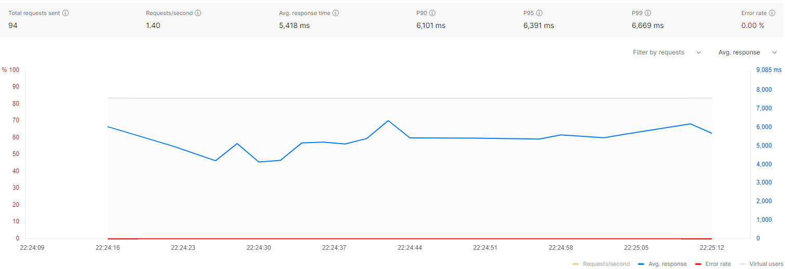
- **테스트2**
  - 10개의 댓글, 각 댓글당 좋아요 1,000,000개
  - 평균 응답속도: 약 9.2초
  - 결과 사진
    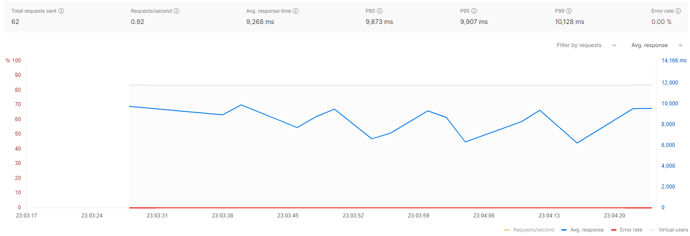

결과적으로 데이터 수가 증가함에 따라 "좋아요 수" 조회 속도가 저하됨을 확인할 수 있었습니다. 이는 COUNT 쿼리가 DB에 부하를 주는 작업이며, 고부하 환경에서 "좋아요 수"를 조회하는 기능이 병목으로 작용할 수 있음을 시사합니다.

## 그래서 이렇게 해결했습니다

매 "좋아요 수" 조회 요청마다 동적으로 좋아요 수를 세는 것은 비효율적이며, 조회가 자주 발생하는 환경에서 적절하지 않음을 위에서 실험으로 확인했습니다. 이러한 COUNT 쿼리의 문제점은 "좋아요 수"를 별도로 저장하고 관리하는 방법으로 해결할 수 있습니다. 이 방법은 "좋아요 수"를 세는 과정 없이 단순 데이터 조회만으로 "좋아요 수"를 조회할 수 있기 때문에 데이터가 많아져도 성능이 저하될 여지가 줄어듭니다.

하지만 "좋아요 수"를 별도로 관리할 경우 동시성 문제가 발생합니다. 다수의 수정 요청(좋아요, 좋아요 취소)이 동시에 발생하면 "좋아요 수"의 데이터 정합성이 깨질 위험이 있습니다. 따라서 요청 간의 동기화가 반드시 필요합니다. 저는 이번 이슈를 해결하면서 동시성 문제로 데이터 정합성이 깨진다는 것을 실험으로 직접 확인했고, 이를 낙관적 락, 비관적 락을 활용해 해결했습니다. 여기에 더 나아가 버퍼를 이용해 "좋아요 수" 쓰기 요청을 모아서 주기적으로 DB에 반영하는 방식으로 쓰기 성능까지 향상해 보았습니다.

결과적으로 3가지 방식(낙관적 락, 비관적 락, 버퍼를 이용한 약한 일관성 보장)을 비교해 데이터 일관성을 일부 희생해 조회 성능과 쓰기 성능을 모두 챙긴 3번째 방식을 채택했습니다.

## 좋아요 수 별도 관리

### 좋아요 수 칼럼 추가

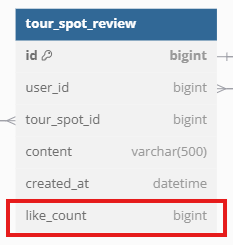

"좋아요 수" 데이터를 저장하기 위해 관광지 후기 테이블(`tour_spot_review`)에 칼럼을 추가했습니다. 별도의 테이블로 분리해 저장하는 방식도 고려해보았습니다. 하지만 현재로서는 향후 변경사항이 있을지도 불분명한 상태이고, 분리에 의한 유지보수성 향상을 기대하기는 힘들다고 판단했습니다. 따라서 테이블 분리는 시기상조인 것 같아 단순하게 기존 테이블에 칼럼을 추가하는 방식을 선택했습니다.

### 동시성 테스트

"좋아요 수"가 별도의 칼럼에 관리되면서 동시성 문제가 발생할 수 있습니다. 같은 레코드의 "좋아요 수"를 변경하는 다수의 쓰기 요청이 동시에 발생하는 경우 데이터 정합성이 깨질 위험이 있습니다. 이를 테스트해보기 위해 아래와 같은 테스트 코드를 작성했습니다.

```java
@Test
void 후기_좋아요를_동시에_요청해도_모두_올바르게_처리된다() throws InterruptedException {
    final int REQUEST_COUNT = 500;
    final long TEST_REVIEW_ID = testTourSpotReview.id();

    List<UserDto> users = userService.findUsers(0, REQUEST_COUNT).stream().toList();
    long beforeCachedLikeCount = tourSpotReviewService.findTourSpotReview(TEST_REVIEW_ID).likeCount();

    final ExecutorService executorService = Executors.newFixedThreadPool(REQUEST_COUNT);
    final CountDownLatch countDownLatch = new CountDownLatch(REQUEST_COUNT);

    final AtomicInteger successCount = new AtomicInteger();
    final AtomicInteger failCount = new AtomicInteger();

    for (int i = 0; i < REQUEST_COUNT; i++) {
        final int userIdx = i;
        executorService.execute(() -> {
            UserDto user = users.get(userIdx);

            try {
                tourSpotReviewLikeService.addReviewLike(user.username(), TEST_REVIEW_ID);
                successCount.getAndIncrement();
                log.info("{}번 사용자 좋아요 요청 성공", userIdx);
            } catch(Exception e) {
                failCount.getAndIncrement();
                log.info("{}번 사용자 좋아요 요청 실패, 실패 원인: {}", userIdx, e.getMessage());
            }
            countDownLatch.countDown();
        });
    }

    countDownLatch.await();

    long afterCachedLikeCount = tourSpotReviewService.findTourSpotReview(TEST_REVIEW_ID).likeCount();

    log.info("성공한 좋아요 요청 수 = {}", successCount);
    log.info("실패한 좋아요 요청 수 = {}", failCount);
    log.info("이전 캐시 좋아요 수 = {}, 이후 캐시 좋아요 수 = {}", beforeCachedLikeCount, afterCachedLikeCount);

    assertEquals(beforeCachedLikeCount + successCount.get(), afterCachedLikeCount);
}
```

`REQUEST_COUNT`만큼의 "좋아요" 요청이 동시에 발생합니다. `이전 좋아요 수` + `성공한 요청 수`가 `이후 좋아요 수`와 일치하면 동시성 문제가 발생하지 않은 것으로 판단해 테스트는 성공합니다.

동시성 제어가 이뤄지지 않는 경우 다음과 같은 결과를 얻을 수 있습니다.

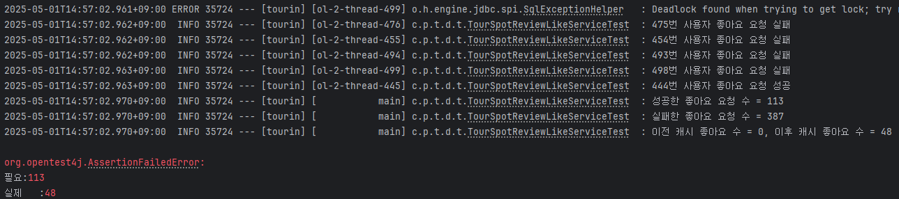

500개의 요청 중 113개의 요청이 성공했습니다. 그리고 성공한 요청이 "좋아요 수"에 온전히 반영되지 못한 것을 확인할 수 있습니다. 이는 동시성 제어 없이 애플리케이션에서 "좋아요 수"를 읽고 갱신하면서 갱신 분실(Lost Update)이 발생했기 때문입니다. 아래와 같이 "좋아요 수"가 같은 값으로 여러 번 갱신된 것을 확인할 수 있습니다.

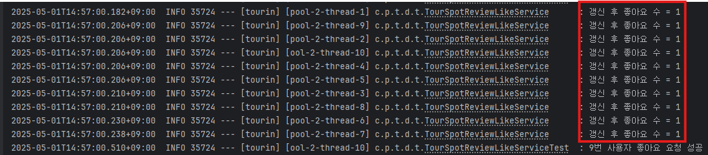

(추가로 요청이 실패한 이유는 동시 요청들에 의해 데드락이 발생했기 때문입니다. 이는 [다른 문서](./데드락%20원인%20분석(좋아요%20기능).md)에서 다루었으므로 관련 내용은 해당 문서를 참조 바랍니다)

따라서 데이터 정합성을 유지하기 위해서는 락을 이용한 동기화 필요합니다.

- 참고 - [`TourSpotReviewLikeServiceTest.java`](/backend/src/test/java/com/positivewand/tourin/domain/tourspot/TourSpotReviewLikeServiceTest.java)

## 낙관적 락

낙관적 락은 데이터 버저닝을 통해 트랜잭션 충돌을 감지하는 동시성 제어법입니다. 트랜잭션 충돌을 발생하지 않을 것이라고 가정하는 방법이며, 충돌이 발생할 경우 트랜잭션을 재시도하거나 실패 처리하는 등의 예외처리가 필요합니다.

### JPA를 이용한 낙관적 락 구현

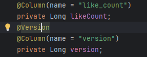

관광지 후기 테이블(`tour_spot_review`)에 버전 칼럼을 추가하고 JPA의 `@Version`을 사용하기만하면 쉽게 낙관적 락을 구현할 수 있습니다. JPA에서 DB에 데이터를 영속할 때 버전 정보를 확인하고, 버전 정보가 기대와 같으면 트랜잭션이 성공하고, 기대와 다르다면 트랜잭션이 실패합니다.

### 테스트 결과 및 문제점

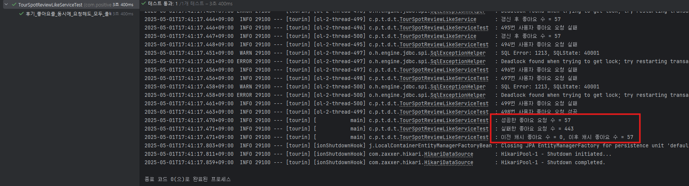

500개의 요청 중 57개의 요청이 성공했습니다. 하지만 이번에는 갱신 분실 없이 성공한 요청이 "좋아요 수"에 모두 반영되어 테스트에 성공했습니다.

(이 방법도 동시성 제어가 없을 때와 마찬가지로 데드락으로 인해 실패한 요청이 발생했습니다. 자세한 내용은 [이 문서](./데드락%20원인%20분석(좋아요%20기능).md)를 참조바랍니다.)

낙관적 락을 이용한 동시성 제어는 아래와 같은 문제가 있습니다.

- 충돌이 발생할 경우를 대비해 예외처리를 구현해야함
- 특별한 예외처리가 없는 경우, 타이밍에 따라 좋아요 요청이 실패 -> 넌센스
- 재시도 요청을 구현해도 요청이 몰릴 경우, 재시도로 인한 네트워크 요청 다수 발생

애초에 낙관적 락은 충돌이 자주 발생하지 않는 데이터에 대해서 적용해야 좋은 성능을 보입니다. "좋아요" 기능의 경우 충돌이 자주 발생할 수 있기 때문에 동시성 제어를 위해 낙관적 락을 사용하는 것은 바람직하지 않습니다.

## 비관적 락

비관적 락은 DB의 락 기능을 활용하는 동시성 제어법입니다. DB 수준의 락을 이용해 다수의 요청을 동기화합니다. 트랜잭션들은 락을 취득하기 위해 경쟁하며 락을 취득하지 못한 트랜잭션들은 대기합니다.

### JPA를 이용한 비관적 락 구현

갱신 손실을 방지하기 위해서는 애플리케이션에서 작업을 하는 동안 데이터 갱신이 발생하지 않도록  "좋아요 수"를 읽는 시점에 베타적 락을 취득해야합니다. `SELECT ... FOR UPDATE` 쿼리를 사용하면 이를 구현할 수 있습니다.

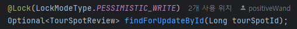

Spring Data JPA에서는 `@Lock`을 이용해 쿼리 실행 시 락을 취득하도록 할 수 있습니다. 위와 같이 정의한 `findForUpdateById`를 기존의 `findById` 대신 사용하면 일반 JPA에서 `SELECT` 쿼리 대신 `SELECT ... FOR UPDATE` 쿼리를 이용해 데이터를 읽습니다.

### 테스트 결과 및 문제점

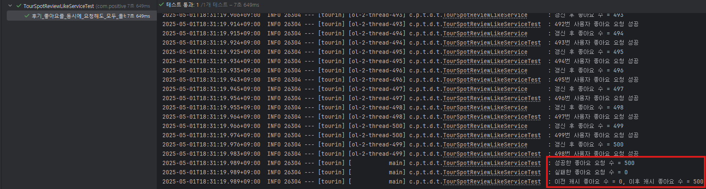

500개의 요청 모두가 성공했습니다. 다만, 락에 의한 대기가 발생하기 때문에 테스트 시간이 7649ms로 이전의 방법들의 2배가 걸린 것을 확인할 수 있습니다.

비관적 락을 사용해 모든 트랜잭션이 성공했습니다. 하지만 락에 의해 갱신 요청이 직렬화되면서 처리 속도가 느려졌습니다. 특히 "좋아요", "좋아요 취소" 요청마다 "좋아요 수"를 1개씩 더하고 빼고 이를 디스크에 반영해야합니다.

## 버퍼를 활용한 약한 일관성 보장

DB 수준에서 동시성을 제어하는 것은 확실하지만 성능적으로는 아쉽습니다. "좋아요 수"를 1개씩 더하고 빼기 위해 디스크 I/O가 발생합니다. 작은 변화를 위해 비싼 I/O(네트워크, 디스크)를 사용합니다. 이를 개선해볼 수 있다고 생각했습니다. 컴퓨터 시스템에서 비용이 비싼 I/O를 최대한 효율적으로 사용하기 위해 데이터를 버퍼링하는 것은 흔합니다. 마찬가지의 아이디어를 "좋아요 수" 갱신에 적용해봤습니다.

### `ConcurrentHashMap`을 이용한 버퍼 구현

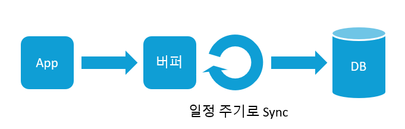

구상은 위 사진과 같습니다. "좋아요 수"의 변화량("좋아요"는 +1, "좋아요 취소"는 -1)을 애플리케이션 버퍼에 누적 저장합니다. 그리고 일정 주기마다 DB에 변화량을 반영합니다. 동시에 발생하는 "좋아요 수" 쓰기 요청은 DB 대신 메모리의 버퍼에 반영됩니다. 이는 DB에서 이뤄지던 동시성 처리를 애플리케이션에서 수행해 I/O 오버헤드를 줄인 것입니다. DB에 곧바로 변경사항이 반영되지 않기 때문에 일시적으로 데이터 일관성이 깨지지만, 쓰기 요청의 성능을 높일 수 있습니다.

```java
@Entity
...
public class TourSpotReview {
    ...

    private static ConcurrentHashMap<Long, Long> likeCountBuffer = new ConcurrentHashMap<>();

    public static Map<Long, Long> flushLikeCountBuffer() {
        final Map<Long, Long> snapshot = new HashMap<>();

        // 스냅샷 찍기
        for (long key: TourSpotReview.likeCountBuffer.keySet().stream().toList()) {
            TourSpotReview.likeCountBuffer.computeIfPresent(key, (tourSpotId, difference) -> {
                snapshot.put(tourSpotId, difference);
                return null;
            });
        }

        return snapshot;
    }

    public void incrementLikeCount() {
        TourSpotReview.likeCountBuffer.compute(this.id, (tourSpotId, difference) -> {
            if(difference == null) return 1L;

            return difference + 1;
        });
    }
    public void decrementLikeCount() {
        TourSpotReview.likeCountBuffer.compute(this.id, (tourSpotId, difference) -> {
            if(difference == null) return -1L;

            return difference - 1;
        });
    }
}
```

버퍼는 Java의 `ConcurrentHashMap`을 이용해 구현했습니다. Thread-safe한 연산을 지원하는 자료구조이기 때문에 다중 쓰레드로 인한 동시성 문제가 발생하지 않습니다. 버퍼는 `TourSpotReview` 엔티티에 정의했고, `incrementLikeCount`와 `decrementLikeCount`로 "좋아요 수"가 갱신됩니다.

```java
@Component
@RequiredArgsConstructor
public class TourSpotScheduler {
    private final TourSpotReviewLikeService tourSpotReviewLikeService;
    private final TourSpotReviewRepository tourSpotReviewRepository;

    @Scheduled(cron = "0 0/1 * * * ?")
    public void syncTourSpotReviewLike() {
        Map<Long, Long> differenceSnapshot = TourSpotReview.flushLikeCountBuffer();

        List<Long> keys = new ArrayList<>(differenceSnapshot.keySet());
        int chunkSize = 500;

        for (int i = 0; i < keys.size(); i += chunkSize) {
            tourSpotReviewLikeService.syncTourSpotReviewLike(
                    keys.subList(i, Math.min(i + chunkSize, keys.size())),
                    differenceSnapshot
            );
            tourSpotReviewRepository.flush();
        }
    }
}
```

데이터 싱크 작업을 위해서는 Spring Scheduler를 사용했습니다. 지정한 주기마다 버퍼의 내용을 DB에 반영합니다. 이때 청크 단위로 변경사항이 반영되도록 했습니다. "좋아요 수"가 변경된 관광지 후기가 많은 경우 트랜잭션 1개로 모든 변경사항을 반영하는 것은 부담이 크기 때문입니다. 트랜잭션 1개로 많은 행이 변경될 경우, 락의 범위가 커짐에 따라 동시성이 저하되고(`UPDATE` 쿼리는 취득한 락을 트랜잭션 동안 유지하기 때문), 트랜잭션이 롤백될 경우 발생하는 반작용도 큽니다.

또한 변화량을 버퍼링하는 방식은 확장가능(scalable)합니다. "좋아요 수"의 변화량을 버퍼링하지 않고 "좋아요 수" 자체를 캐시해 사용한다면 데이터 일관성이 깨지기 쉽습니다. 스케일-아웃으로 서버가 여러 대 생기면 각 서버는 각자만의 "좋아요 수"를 가지게 되고, 이를 DB에 쓰면서 갱신 손실 문제가 발생할 수 있습니다. 하지만 변화량을 버퍼링할 경우, 서버끼리 같은 데이터를 갱신하면서 락 경합이 발생할 수 있지만, 여전히 데이터 일관성을 위배하지 않으면서 비관적 락을 사용한 방법보다 효율적입니다.

- 참고
  - [`TourSpotReview.java`](/backend/src/main/java/com/positivewand/tourin/domain/tourspot/entity/TourSpotReview.java)
  - [`TourSpotScheduler.java`](/backend/src/main/java/com/positivewand/tourin/domain/tourspot/TourSpotScheduler.java)

### 성능 향상시키기(with 배치 업데이트)

앱에서는 Hibernate의 Dirty Checking을 이용해 변경사항을 DB에 반영합니다. 이때 변경된 관광지 후기만큼 `UPDATE` 쿼리가 발생합니다. 하지만 쿼리마다 네트워크 요청이 발생하는 것은 비효율적입니다. 따라서 Hibernate의 Batch UPDATE를 설정해 성능을 개선했습니다. 10,000개의 관광지 후기의 좋아요 수를 갱신하는 테스트를 구성해 성능 향상을 확인해보았고, 아래 사진과 같이 작업 시간을 9598ms에서 2235ms(배치 크기 = 100)로 줄일 수 있었습니다.

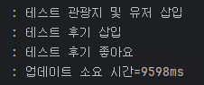

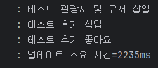

- 참고
  - [`TourSpotSchedulerTest.java`](/backend/src/test/java/com/positivewand/tourin/domain/tourspot/TourSpotSchedulerTest.java)

### 테스트 결과 및 문제점

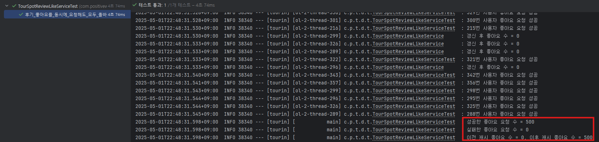

500개의 요청 모두가 성공했습니다. 또한 비관적 락을 사용했을 때보다 테스트 시간이 줄어든 것을  확인할 수 있습니다.

### 문제점

변경사항이 DB에 곧바로 반영되지 않기 때문에 문제가 발생합니다. "좋아요 수"의 실시간성이 떨어지게 됩니다. 그리고 서버가 DB에 반영되지 않은 데이터를 가지고 다운될 경우 데이터가 유실됩니다.

## 결론

각 방법을 비교하면 아래 표와 같습니다.

| | 동시성 처리 x | 낙관적 락 | 비관적 락 | 메모리 버퍼 |
|:-:| :-: | :-: | :-: | :-: |
|동시성 테스트 성공|x|o|o|o|
|소요시간|3237ms|3400ms|7649ms|4074ms
|요청 성공률|22%|11%|100%|100%|

최종적으로는 읽기/쓰기 성능을 모두 잡을 수 있는 메모리 버퍼 방식을 채택하였습니다. "좋아요 수"가 실시간으로 반영될 필요가 없고, 좋아요 데이터 자체는 DB에 영속되기 때문에 유실된 데이터도 쉽게 복구할 수 있다고 판단했기 때문입니다.

### 아쉬운 점 및 향후 계획

메모리 버퍼 방식을 택하면서 아쉬운 점이 몇가지 있습니다. 먼저, 데이터 비일관성으로 인한 사용자 경험 저해입니다. 좋아요 수가 200개, 300개 같이 많은 경우에는 상관이 없지만, 좋아요 수가 0개인 후기를 사용자가 좋아요 수를 1개로 만들면 문제가 발생합니다. 좋아요 요청이 성공하면 클라이언트에서 UI상에서 1을 더해 좋아요 수를 출력하기 때문에 해당 사용자 세션에서는 문제가 없습니다. 다만, 페이지를 재방문하는 등 세션이 초기화되면 자칫 사용자가 좋아요를 했는데도 불구하고 좋아요 수가 0개로 표시될 수 있습니다. 이는 DB에 즉각적으로 데이터가 반영되지 않으면서 발생하는 문제입니다.

이를 위한 처리를 서버에서 수행할 수도 있지만 클라이언트에서 쉽게 수정할 수 있을 것 같습니다. 좋아요 수의 실시간성은 크게 중요하지 않기 때문에 사용자가 좋아요를 했다면 클라이언트에서 임의로 좋아요 수를 1개 더하는 방식으로 해결할 수 있습니다. 이렇게 문제를 해결하면 비록 실제 좋아요 수와 UI에 출력되는 좋아요 수는 다를 수 있지만, 사용자 경험을 더 좋게 만들 수 있습니다.

또한 데이터 유실 가능성입니다. 서버가 다운되면 좋아요 수 변화량이 유실됩니다. 따라서 "좋아요 수"를 관리하는 책임을 Redis와 같은 인메모리DB 인스턴스로 분리할 수 있습니다. 이렇게 하면 고가용성 환경을 구성해 데이터 유실 가능성을 줄일 수 있습니다.
