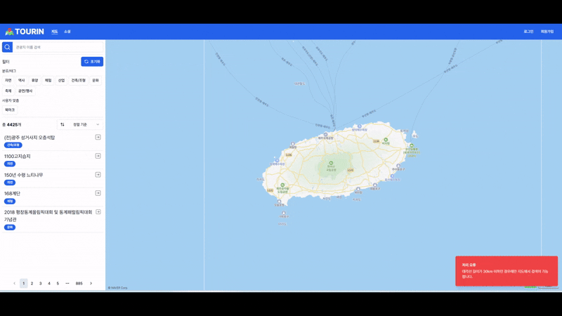

# 지도에 표시되는 관광지 제한
## 배경
- TOURIN은 지도 상에 검색된 관광지의 위치를 표시
- Naver Map을 이용해 지도 표현
  - 마커를 사용해 관광지 위치 표시

## 문제
TOURIN은 한국관광공사에서 제공하는 공개 API를 이용해 약 4500개의 관광지 데이터를 확보해 사용자에게 제공합니다. 그리고 지도를 이용해서 관광지를 찾을 수 있도록 기능을 제공합니다.

확보한 데이터를 서비스로 제공하려고 고민해보니, 무작정 모든 관광지를 표시하는 것은 적절하지 않았습니다. 그 이유는 아래와 같습니다.

1. 모든 관광지에 대한 정보를 한번에 요청하는 것은 비효율적입니다. 사용자가 사용하지도 않을 데이터를 요청하고 처리하는 것은 클라이언트, 네트워크, 서버 모두에게 비효율적입니다.
  
2. 성능 상의 이유로 지도 앱에서 표시할 수 있는 관광지의 개수는 제한됩니다. TOURIN에서는 Naver Map API를 사용하고 있고, 관련 [포럼](https://developers.naver.com/forum/posts/26171)에서 마커의 개수가 200~250개 되는 지점부터는 서비스가 어려운 상태라고 말하고 있습니다. 

3. 지도 상에 마커가 너무 많이 표시되는 것은 사용자에게 유용한 정보를 제공하지 못합니다. 과도한 정보가 제공되는 것은 사용자를 혼란스럽게 하고 서비스 사용을 꺼리게 만듭니다.

## 문제 해결
### 사용자가 보고있는 영역에 맞춰 관광지 표시



사용자가 보고 있는 지도 영역이 일정 크기 이하일 경우에만 관광지를 지도에 표시하는 방법으로 기능을 구현했습니다. 사용자가 적당한 수준까지 지도를 확대했을 때에만 관광지가 지도에 표시됩니다. 사용자가 보는 지도 영역이 변할 때마다 클라이언트는 서버에게 요청을 보내고, 서버에서 영역의 크기가 적당한지 판단합니다. 지도 영역이 정해진 크기 이하라면 관광지 데이터를 반환합니다. 하지만 지도 영역이 너무 넓다면, 서버는 요청 처리를 거부하고 클라이언트에서는 사용자에게 지도를 확대할 것을 요구합니다.

지도 영역 크기를 제한하게 되면 지도 상에 표현해야하는 관광지의 개수가 줄기 때문에 성능 상으로도 문제가 없고, 사용자에게 과도하게 많은 정보가 제공되지도 않습니다.

### Haversine 공식을 이용한 영역 크기 측정
사용자가 보는 지도 영역의 크기를 측정하기 Haversine 공식을 사용했습니다. 처음에는 위경도 좌표의 차이를 이용해 크기를 판단하려 했지만, 단순히 위경도 좌표의 차이를 이용하는 것은 아래와 같은 문제점이 있었습니다.

1. **위경도 좌표 차이의 불균일성** - 지구는 둥급니다. 그렇기 때문에 위경도 좌표끼리 같은 1도가 차이나더라도 지구 상의 위치에 따라 거리가 달라집니다. 대한민국이라는 작은 영역에서는 왜곡의 정도가 미묘하겠지만, 위경도 좌표의 차이를 이용한 기준은 여전히 다음에 제시될 이유로 적절치 않습니다.
2. **이해하기 힘든 기준** - 대한민국 내에서 좌표의 차이는 많아봤자 1~2도 정도로 수치적으로 차이가 미묘합니다. 따라서 영역의 크기가 얼마나 넓은지 감이 잡히지 않아 기준을 잡기도, 이해하기도 어렵습니다.

위경도 좌표의 거리를 km로 변환하는 공식이 있는데 그것이 Haversine 공식입니다. km로 변환해 판단한다면 위치에 따른 크기의 왜곡이 없고, 크기에 대해 쉽게 가늠할 수 있습니다.

### Debounce를 이용한 불필요한 요청 방지
사용자가 보는 지도 영역이 변할 때마다 클라이언트는 서버에게 요청을 보냅니다. 이는 Naver Map에서 `bounds`값이 변할 때 발생하는 이벤트를 구독하는 것으로 구현할 수 있습니다. 하지만 이를 순진하게 구현할 경우, 사용자가 지도를 드래그하거나 확대할 때 수백 개의 요청이 발생합니다. 지도 영역이 변하면서 이벤트 발생기에서 허용하는만큼 `bounds`값 변경 이벤트가 발생하기 때문입니다.

이 문제를 Debounce로 최적화할 수 있습니다. Debounce는 연속적으로 발생하는 이벤트를 하나의 이벤트로 처리하는 기법으로 이와 같은 문제를 해결하기에 적합합니다. `Timeout` 객체가 1개만 유지되도록 하는 방식으로 구현할 수 있습니다.

```javascript
let debounceTimer;

map.addListener('bounds_change', () => {
  if (debounceTimer) {
    clearTimeout(debounceTimer);
  }

  debounceTimer = setTimeout(() => {
    // 요청 보내기...
  }, 300);
})
```

하지만 위 구현은 사용자가 드래그를 오래하는 경우에 문제가 발생합니다. 사용자가 300ms 이상 드래그를 하면 드래그 중에 요청이 발생합니다. 사용자가 드래그 중일 때는 지도를 원하는 위치까지 완전히 옮기지 않았기 때문에, 이때 요청이 발생하는 것은 적절치 않다 생각했습니다. 이를 해결하기 위해 `dragging` 플래그를 추가했습니다. 드래그가 시작되면 `dragging` 플래그가 활성화되고, 드래그가 끝나면 `dragging` 플래그를 비활성화합니다. 요청을 보내기 전에 드래그 여부를 확인하기 때문에, 드래그 중이라면 요청이 발생하지 않게 됩니다. 결과적으로 Debounce 기법으로 불필요한 요청을 없애고, 필요할 때만 서버에 요청을 보내도록 할 수 있었습니다.

```javascript
let debounceTimer;
let dragging = false;

map.addListener('dragstart', () => {
  dragging = true;
});

map.addListener('dragend', () => {
  dragging = false;
});

map.addListener('bounds_change', () => {
  if (debounceTimer) {
    clearTimeout(debounceTimer);
  }

  debounceTimer = setTimeout(() => {
    if (dragging) return;

    // dragging == false일 때만 요청 보내기...
  }, 300);
})
```

## 향후 발전 계획
현실적으로 지도에 모든 관광지를 표시할 수 없었기에 사용자에게 지도를 일정 수준 이상까지 확대하도록 유도했습니다. 하지만 현재 구현은 지도를 넓게 볼 때는 사실상 아무런 정보를 얻지 못합니다. 이를 보완하기 위해 지도상에서 구역(도/시/군/구 등)을 나누고, 구역별로 요약 정보(관광지 종류별 개수 등)를 제시하면 좋을 것 같습니다.

## 참조
- [`map.tsx`](https://github.com/positiveWand/project-trip-sns/blob/main/frontend/src/app/map-page/map.tsx) - Debounce로 요청 최적화
- [`TourSpotController.java`](https://github.com/positiveWand/project-trip-sns/blob/main/backend/src/main/java/com/positivewand/tourin/web/tourspot/TourSpotController.java) - `GET /tour-spots/map` 처리 시, Haversine 공식을 이용해 영역 크기 판단