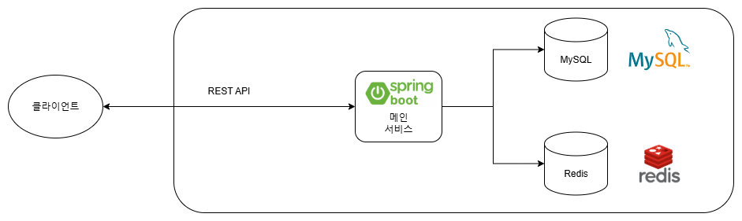
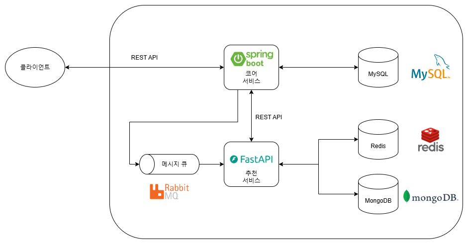
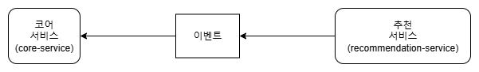
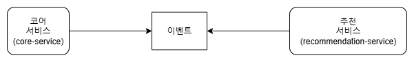

# 추천 시스템을 별도의 서비스로 분리하기
## 배경
TOURIN은 사용자들의 로그를 기반으로 관광지를 추천하는 기능(트렌드 기반 관광지 추천, 조회/북마크 로그 기반 관광지 추천)이 있습니다. 그리고 관광지 추천은 사용자들의 직접적인 요청으로 이뤄지지 않고 비동기적으로 처리됩니다. 평소 프로젝트를 진행하며 MSA를 적용해보고 싶다는 생각이 있었고, 추천 시스템의 특성상 분리된 서비스로 구현하기 알맞은 것 같아 추천 관련 기능을 별도의 분산된 서비스로 분리해봤습니다. 이 기회로 MSA를 직접 설계 및 구현해보면서 말로만 듣고 피상적으로 알고있던 MSA에 대한 이해를 높일 수 있었습니다.

## MSA 배경
MSA를 도입하기 전, MSA가 도입된다면 왜 도입되어야하는지에 대해 조사했습니다. MSA는 **MicroService Architecture**의 약자로 시스템이 하나의 거대한 애플리케이션인 고전 Monolithic 아키텍처와는 다르게 시스템을 여러 개의 애플리케이션으로 분리한 구조입니다. 시스템을 여러 서비스로 쪼개면 다음의 장점이 있습니다.

- **기능별 독립적인 확장**: 모놀리식 아키텍처는 모든 기능이 하나의 애플리케이션에 존재하기 때문에 scale-out이 이뤄질 경우 확장이 필요하지 않은 기능까지 덩달아 확장됩니다. 이는 비효율적인 자원 활용으로 이어집니다. 반면에 MSA는 기능별로 애플리케이션이 분리되어 있기 때문에 확장이 필요한 기능에 대해서만 자원이 추가적으로 투입되어 효율적인 자원 활용이 가능합니다.
- **기능 간 결합도 감소**: 기능이 별도의 애플리케이션으로 분리되기 때문에 컴포넌트 간 결합도가 자연스레 감소합니다. 특정 기능의 오류로 애플리케이션 전체가 fail하는 경우가 적어지고, 애플리케이션이 분리되었기 때문에 통일된 기술 스택을 선택할 필요 없이 완전히 다른 기술 스택을 이용해 개발할 수 있는 자유가 생깁니다.

하지만 MSA가 장점만 있는 것은 아닙니다. 다음의 단점이 있습니다.

- **운영 복잡도/비용 증가**: 여러 서비스를 운영하면서 그것들의 연결까지 관리하기 때문에 자연스레 운영 복잡도가 올라가고 그에 따라 투입되는 비용도 증가합니다. 서비스 디스커버리, 모니터링, 메시징 등 운영에 필요한 기능이 추가됩니다. 거기다 각 서비스의 모니터링과 디버깅이 어려워집니다. 모놀리식 아키텍처와 비교했을 때 여러모로 투입되는 비용이 증가합니다.

운영 복잡도와 비용 증가 때문에 기능별 독립적인 진화/확장이 필요한 경우가 아니라면 MSA를 도입하지 않는 것이 좋을 수 있다는 것을 유의해야합니다. TOURIN은 AI/ML 관련 라이브러리들이 Java보다는 Python에 친화적이라는 점, 추천 시스템은 다른 기능들과 결합되지 않아 분리가 자연스럽다는 점, 학습 목적의 프로젝트라는 점을 고려해 MSA를 도입했습니다.

## 서비스 구조
### 분리 이전


기존의 모놀리식 서비스는 하나의 단일 서비스(이하 메인 서비스)에서 모든 기능이 처리됩니다. 비즈니스 데이터는 MySQL에서 관리되고 관광지 추천을 위해 관광지 조회 및 북마크 이벤트를 탐지하고 집계합니다.

### 분리 이후


기존의 메인 서비스는 코어 서비스(core-service)로 이름이 바뀌었고 메인 서비스의 관광지 추천 기능은 별도의 애플리케이션(recommendation-service)으로 분리했습니다. 코어 서비스에서는 추천에 사용될 수 있는 이벤트를 메시지 큐에 발행하고, 추천 서비스에서는 이벤트를 소비합니다. 이벤트 스트림을 처리하며 관광지 트렌드를 집계(Redis)하고 유사도 기반 관광지 추천 기능이 추가되어 사용자가 관심있어할만한 관광지를 예측해 저장(MongoDB)합니다.

추천 서비스에서는 익숙한 ML 라이브러리를 활용하기 위해 Python을 채택했고 유연한 스키마, 사용의 단순함 때문에 MongoDB를 DB로 선택했습니다. 추천 서비스에서 사용하는 데이터는 데이터끼리의 연관관계를 일관되게 관리할 필요성이 적고, JSON 도큐먼트의 유연한 스키마가 데이터/ML 관련 도메인에 더 어울린다고 판단했습니다.

이벤트 브로커로는 RabbitMQ를 사용했습니다. 이벤트 브로커로는 Kafka가 더 적절할 수 있겠으나 러닝 커브가 가파르고 세팅이 복잡한 점이 걸렸습니다. 그리고 RabbitMQ를 사용해도 이벤트 브로커의 역할에 대해서 배우는데 부족함이 없다고 생각했습니다.

### 신경 쓴 점
MSA를 설계 및 구현하면서 아래와 같은 점들을 신경썼습니다.

관광지 추천 기능을 추천 서비스에서 책임지기 때문에 클라이언트는 추천 기능 사용을 위해서 추천 서비스의 호스트 URL을 알고 있어야합니다. 하지만 URL의 단순함을 위해 코어 서비스가 프록시 역할을 수행해 클라이언트 대신 추천 서비스에 요청을 보내도록 했습니다.

또한 분산 시스템에서는 단일 시스템에서 보장되던 많은 것들이 무효화됩니다. 특히 단일 시스템에 비해 분산 시스템의 통신 신뢰성은 매우 떨어지며 이벤트를 발행하면 이벤트가 중복되거나 그 순서가 바뀔 수 있습니다. TCP는 바이트 스트림의 신뢰성을 보장하지만 애플리케이션 수준의 신뢰성은 보장하지 못하므로 애플리케이션에서 이러한 신뢰성을 책임져야합니다. 완전한 신뢰성 보장을 위해서는 이벤트 발행자/브로커/소비자가 모두 협력해야합니다. 하지만 추천 관련 기능은 결제 기능과 같이 강력한 신뢰성, 일관성이 필요하지 않습니다. 따라서 ACK와 이벤트 식별키를 활용해 약하게 신뢰성을 보장하는 방식을 구현했습니다.

## 이벤트 설계
추천 시스템은 사용자의 관광지 조회/북마크 이벤트를 기반으로 작동합니다. 여기서 이벤트는 중립적으로 설계되어야 합니다. 특정 로직이나 서비스에 종속되지 않는 이벤트를 설계하면 기존 시스템에 영향을 주지 않는 확장 가능한 시스템이 만들어지기 때문입니다. 의존성 역전의 일종이라고 생각해도 좋습니다.



위와 같이 이벤트 발행자인 코어 서비스에 이벤트가 의존하게 된다면 자칫 코어 서비스의 변경이 추천 서비스로 전파될 가능성이 있습니다. 이는 서비스 간의 독립적인 확장을 방해합니다.



하지만 서비스들이 중립적인 이벤트에 의존(의존성 역전)하도록 하면 어떤 서비스에 변화가 생겨도 다른 서비스들은 영향을 받지 않습니다.

[이 영상](https://www.youtube.com/watch?v=DY3sUeGu74M)을 참조해 이벤트를 설계했고, 이벤트 객체의 스키마와 각 필드 역할은 아래와 같습니다.

- **id**: 이벤트 식별자입니다. 이벤트 발행자가 부여하며 이벤트끼리 중복되지 않아 중복 제거에 활용될 수 있습니다.
- **type**: 이벤트 타입입니다. 이벤트의 종류를 명시하고 이에 따라 **data** 필드의 스키마가 결정됩니다.
- **timestamp**: 이벤트 발생 시간입니다. 이를 사용해 시의적절하지 않은 이벤트(너무 오래된 이벤트 등)를 필터링할 수 있습니다.
- **data**: 이벤트 데이터입니다. **type** 필드에 따라 내용이 달라지며 이벤트 행위자, 행위 대상과 같이 이벤트 관련 정보가 저장됩니다.

## 이벤트 발행
이벤트를 발행하는 로직은 기존의 코드를 활용해 어렵지 않게 구현할 수 있었습니다. Spring AOP를 이용해 이벤트를 감지하는 코드에서 추천 서비스를 호출하는 대신 이벤트를 발행하도록 했습니다. 관광지 조회/북마크 이벤트가 발생하면 Spring AOP에서 이를 감지하고 RabbitMQ에 해당 이벤트를 발행합니다.

분산 환경에서 이벤트가 확실히 처리되기를 원한다면 이벤트 발행자에서는 이벤트 브로커에 이벤트 발행이 확실히 이뤄지도록 보장해야합니다. 이벤트 처리 책임을 이벤트 브로커에 확실히 넘겨야합니다. 이를 구현하기 위한 패턴으로 Transactional Outbox 패턴 등이 있으며 완전한 보장을 위해 영속 DB를 사용합니다만... TOURIN에서는 관련 구현을 하지 않았습니다. 그 이유는 추천 관련 로그 이벤트를 DB에 저장하고 이것이 확실히 소비되도록 보장하는 것은 오버엔지니어링이라고 생각했기 때문입니다. 잠시 동안 추천 기능이 동작하지 않더라도 서비스를 사용하는데 엄청난 지장이 있지 않고, 관련 기능을 구현하고 유지보수하는데 들이는 비용까지 고려하면 이 정도에서 멈춰는 게 좋을 것 같았습니다.

## 이벤트 중개
RabbitMQ는 발행자로부터 이벤트를 받아 소비자에게 전달하는 이벤트 브로커입니다. 분산 환경에서 이벤트가 제대로 소비되도록하려면 이벤트 브로커도 적절히 설정되어야합니다.

이벤트 브로커는 발행자가 전달한 이벤트를 적절한 소비자에게 전달해야합니다. RabbitMQ는 exchange라는 개념을 활용해 이벤트 전달 및 라우팅을 수행합니다. 이때 exchange를 정의할 때 특정 유스케이스에 의존하지 않도록 주의해야합니다. 앞서 언급했듯 이벤트 도메인은 특정 서비스에 의존하지 않고 오히려 서비스가 이벤트 도메인에 의존하는 형태여야하기 때문입니다. 따라서 exchange를 `recommendation.event.ex`와 같이 특정 유스케이스에 한정된 이름이 아닌 `event.user.ex`와 같은 중립적인 이름을 사용하도록 설정했습니다. 이렇게 중립적으로 정의해야만 새로운 유스케이스가 생길 때마다 exchange를 새롭게 정의하거나 발행자의 코드가 바뀌지 않고 이벤트에 관심이 있는 서비스가 구독만 하면 되는 방식으로 쉽게 확장될 수 있습니다.

분산 환경에서의 신뢰성 보장을 위해서도 적절한 설정이 필요합니다. 이벤트 발행자로부터 이벤트를 전달받으면 그것이 유실되지 않도록 책임져야하기 때문에 이벤트가 휘발되지 않도록 영속성 관련 설정이 필요합니다. RabbitMQ에서는 큐의 영속성을 설정하면 장애가 발생해도 이벤트가 유실되지 않도록 할 수 있습니다만... TOURIN에서는 관련 설정을 하지 않았습니다. 로그 데이터를 영속할 필요가 적고 설정해두면 오히려 디버깅이 어려워졌기 때문입니다.

## 이벤트 소비
추천 관련 서비스를 분리한 recommendation-service는 이벤트 브로커로부터 이벤트를 받아 아래와 같은 순서로 처리됩니다.

1. **이벤트 수신**
2. **이벤트 validation**: 이벤트의 스키마를 검증합니다. 기대하고 있는, 처리할 수 있는 이벤트인지를 검증합니다. 만약 validation에 실패하면 이벤트 소비를 거부합니다.
3. **이벤트 만료 처리 및 멱등성 보장**: 전달된 이벤트가 만료됐는지 확인하고, 또한 중복으로 처리되지 않도록 합니다. 너무 오래된 이벤트를 뒤늦게 처리하는 것은 불필요하고 이벤트를 중복으로 처리해서는 안되기 때문에 만료된 이벤트, 중복된 이벤트는 소비되지 않고 무시됩니다.
4. **이벤트 처리**: 이벤트를 소비합니다.
5. **ACK 회신**: 이벤트 소비 과정이 모두 성공적으로 처리됐다면 이벤트 브로커에게 ACK를 회신합니다.

구현을 하며 신뢰성에 대한 특별한 가정이 생기지 않도록 유의했습니다. 지금 당장 환경을 통제하고 있다고 착각할 수 있지만 시간이 지나면서 시스템이 어떻게 바뀔지 모르기 떄문에 신뢰성에 대한 낙관적인 가정은 하지 않는 것이 맞습니다. 낙관적인 가정에 의존하게 되면 그것은 암무적인 결합도 증가로 이어지고 유지보수성을 저하합니다. 따라서 이벤트 중복, 순서 오류가 발생할 수 있음을 가정해 이벤트 소비 로직을 구현했습니다.

### at-least-once 전달과 소비 멱등성 보장
RabbitMQ는 기본적으로 ACK를 이용해 메시지의 at-least-once 전달을 보장합니다. 따라서 이벤트 중복이 발생할 수 있습니다. 이때 이벤트 처리 로직은 소비 멱등성이 보장되도록 구현하는 것이 중요합니다. 멱등성을 보장하기 위한 다양한 방법이 있지만 TOURIN에서는 아래와 같이 이벤트 id를 이용해 중복을 식별하고 무시합니다(`이벤트 설계` 참조).

```python
...
if not try_single_consume(f'idem:recommendation:trend:{event.id}', 3600):
    return 'DUPLICATE' # 중복된 이벤트이므로 무시
...
```

하지만 위 방법은 완전한 멱등성을 보장하지는 않습니다. 위 방법은 이벤트 처리를 시작하면서 멱등성 키를 설정하지만 처리 도중 실패할 경우 처리가 되지 않았는데 멱등성 키가 설정된 상황이 생길 수 있습니다. 완전한 멱등성 보장을 위해서는 이벤트 처리와 멱등성 키 설정이 원자적으로 이뤄질 수 있도록 해야합니다. 하지만 그것을 구현하기 위한 투자는 이벤트 발행자에서와 마찬가지로 로그 이벤트 처리에는 오버엔지니어링이므로 이 정도 구현에서 멈췄습니다.

## 느낀 점과 부족한 점
MSA를 직접 구현해보면서 서비스 간 결합도를 낮추는 방법과 분산 환경에서 신뢰성을 보장하는 방법에 대해서 조사하고 고민해볼 수 있었습니다. 특히 신뢰성 보장의 경우  강하게 일관성을 보장하도록 구현해보지는 않았지만 메시지 신뢰성 보장을 위한 구현이 TCP가 신뢰성을 보장하는 방식에서 크게 벗어나지 않으며 시스템 장애에도 휘발되지 않는 영속 DB를 추가로 필요로 한다는 것을 알 수 있었습니다.

구현을 완료하니 아쉬운 점도 보입니다. 관광지 추천을 받기 위해 core-service가 recommendation-service에 대신 요청을 보내는 형태인데 core-service에서 요청을 프록시하는 대신 전방에 NGINIX와 같은 리버스 프록시 또는 API 게이트웨이를 둔다면 더 효율적일 것 같습니다.