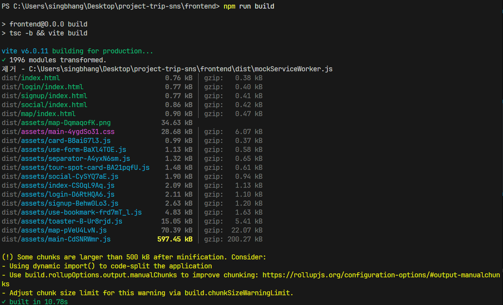
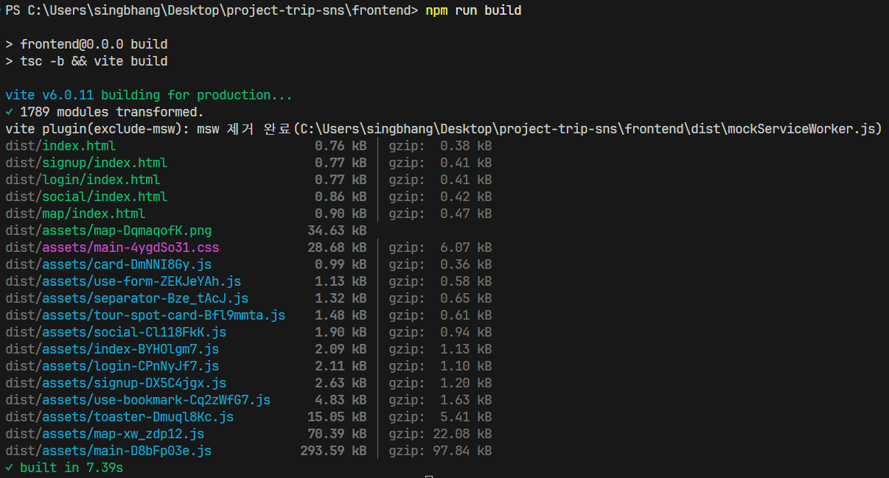

# 테스트
## 배경
소프트웨어는 다양한 요구사항을 만족해야합니다. 모든 구현이 완료된 후에 의도한대로 동작하는지에 대한 검증을 할 수 있지만, 소프트웨어의 규모와 복잡도가 커지면 그런 방식의 검증은 번거롭습니다. 문제가 발생했을 때 문제 원인을 진단하기 위해 시스템 전체를 대상으로 검증을 수행해야 하기 때문입니다. 시스템의 크기가 증가함에 따라 검증해야하는 요소가 기하급수적으로 늘기 때문에 많은 시간과 노력이 필요합니다. 따라서 개발을 하면서 적절히 작은 단위의 테스트를 중간에 진행하는 것이 좋습니다. 하지만 검증에 집중하다보면 막상 구현이 미뤄져 프로젝트 진행이 늦춰지게 됩니다.

~~프로젝트를 진행하며 테스트의 필요성을 느낌과 동시에 너무 작은 단위를 대상으로 진행하는 테스트의 단점을 체감했습니다.~~ 결과적으로 다음과 같은 방식으로 검증을 진행했습니다.

- 클라이언트와 서버를 분리한 테스트
  - 클라이언트 - MSW를 이용한 서버 모킹
  - 서버 - MockMvc를 이용한 요청 모킹

[추가] 2025.08.02 - MockMvc를 이용해 API가 기대한대로 동작하는지 검증하는 테스트를 추가

## MSW를 이용한 서버 모킹
클라이언트 테스트를 위해서 [MSW(Mock Service Worker)](https://mswjs.io/)를 사용했습니다. MSW는 [서비스 워커](https://developer.mozilla.org/ko/docs/Web/API/Service_Worker_API) 기술을 이용해 실제로 네트워크 요청을 보내고 응답하는 과정까지 모킹하기 때문에 쉽게 서버와 독립적인 테스트 환경을 구성할 수 있습니다.

### 서버 상태가 필요한 테스트
API 모커를 구현하면서 특히, 서버 상태를 필요로 하는 API를 모킹하면서 문제가 발생했습니다.

프로젝트의 서버 API는 기본적으로 REST API를 지향하지만 세션 인증 방식의 인증/인가 매커니즘을 사용합니다. 그렇기에 서버에서 세션 관련 상태를 유지하고 있습니다. 그리고 세션ID로 식별된 사용자는 비즈니스 정책에 따라 서비스가 인가됩니다. 이때, 인증/인가 상태에 따라 API 응답이 달라질 수 있습니다.

다양한 상황(올바른 응답이 반환된 상황, 응답이 거부된 상황 등)을 테스트 하기 위해 API 모커는 인증/인가 상태에 따라 응답이 달라져야 했습니다. 그래서 처음에는 다음과 같은 방법을 고려했습니다.

1. 인증/인가 로직 구현
2. 주석을 이용해 원하는 응답 메시지 반환

하지만 1번 방법은 사실상 간단한 서버를 구현하는 것과 다를 것이 없고 2번 방법은 API를 찾고 주석 처리를 켜고 끄는 번거로운 과정이 요구됩니다. 그래서 고민 끝에 아래와 같은 방법을 고안습니다.

- 인증/인가 관련 상태를 토큰 형태로 `config.ts` 파일에 보관
- 해당 토큰을 참조해 API 모커에서는 적절한 응답을 반환

토큰의 유무 혹은 논리값(true/false) 상태에 따라 인증/인가 상태를 판단하기 때문에 약간의 로직만을 추가해 관련 API를 쉽게 모킹했습니다. 테스트 시 `config.ts` 파일을 조작하기만 하면 원하는 서버 응답이 반환되도록 했습니다.

### 빌드 시 테스트 코드 제거
빌드 시 테스트 코드가 포함되는 문제를 발견했습니다. 테스트 코드는 개발 시에만 필요하기 때문에 배포 시에는 제외되어야합니다. 불필요한 용량만 차지하고 파일 전송 시간을 높이게 됩니다. 제외되어야하는 코드는 크게 2가지 입니다.

- 서비스 워커 코드(`/frontend/public/mockServiceWorker.js`)
- API 핸들링 코드(`/frontend/src/mocks/*`)

서비스 워커 코드는 `public` 디렉토리에 위치하기 때문에 Vite의 [기본 동작](https://ko.vite.dev/guide/assets.html#the-public-directory)상 빌드에 무조건 포함되게 됩니다. 또한 API 핸들링 코드는 Javascript 코드에서 import되어 사용되기 때문에 번들링 시 자동으로 포함됩니다.

다음과 같은 방식으로 두 요소를 빌드에서 제외했습니다.

- 서비스 워커 코드 - 빌드하면서 파일을 제거하는 Vite 플러그인 정의
- API 핸들링 코드 - Rollup의 Tree Shaking 활용, `process.env.NODE_ENV` 환경변수 값에 따른 조건부 import를 이용해 빌드에서 제외
  - `process.env.NODE_ENV`의 값이 `'development'`인 경우 import되지 않음

위 이미지가 테스트 코드 제거 전이고, 아래 이미지가 테스트 코드 제거 후입니다. 빌드 용량이 크게 감소한 것을 확인할 수 있습니다.

### 참조
- [`config.ts`](https://github.com/positiveWand/project-trip-sns/blob/main/frontend/src/mocks/config.ts) - 인증/인가 관련 상태 보관
- [`vite.config.ts`](https://github.com/positiveWand/project-trip-sns/blob/main/frontend/vite.config.ts) - 빌드 시 `mockServiceWorker.js` 제거
- [`init.ts`](https://github.com/positiveWand/project-trip-sns/blob/main/frontend/src/init.ts) - Tree Shaking을 활성화하기 위한 조건부 import

## Postman을 이용한 테스트
서버 테스트를 위해서 [Postman](https://www.postman.com/)를 사용했습니다. Postman을 사용하면서 느낀 장점은 아래와 같습니다.

- 쉽고 빠른 요청 메시지 구성
  - 쿼리 파라미터, HTTP Body를 쉽게 넣고 빼고 바꾸는 것이 가능합니다
- 반복가능한 테스트
  - 엔드포인트별로 Request를 만들어두면 이후 반복적으로 사용할 수 있습니다
- Performance Run 제공
  - API 성능을 측정할 수 있는 기능
  - 이 기능을 활용해 부하테스트를 진행하고 관련 성능 지표를 시각화된 형태로 확인할 수 있습니다

## MockMvc를 이용한 테스트
MockMvc는 Spring MVC 앱을 테스트할 수 있는 프레임워크입니다. 웹 서버의 구동 없이 웹 요청을 모킹합니다. MockMvc는 Controller만을 테스트하기 위해서 사용되기도 하지만 이 프로젝트에서는 Controller, Service, Repository를 한번에 테스트하는 통합 테스트 용도로 사용했습니다. 설정한 DB 상태에 맞춰 원하는 응답이 반환되는지, 응답 JSON 스키마가 유효한지, 비즈니스 요구사항에 따라 인증/인가가 이뤄지는지 등을 검증할 수 있도록 테스트 케이스를 작성했습니다.

### 수동 테스트의 문제점
Postman을 이용해 수동으로 테스트하는 것은 매번 바닥부터 요청 메시지를 구성해 테스트하는 것보다는 편하지만 여전히 아래의 이유로 불편했습니다.

- **DB 상태 구성**: 올바른 검증을 위해서는 DB를 특정 상태로 만드는 것은 중요합니다. 따라서 DB에 데이터를 삽입/삭제하는 등의 사전 작업이 항상 필요했습니다.
- **인증/인가 로직 테스트 번거로움**: 인증/인가 로직을 검증하기 위해 반복적으로 로그인/로그아웃하며 테스트를 진행해야했습니다.
- **실수 가능성**: 사람이 직접 수행하다보니 실수하거나 누락하는 경우가 발생합니다.
- **수동 반복**: 위의 작업들을 사람이 매번 반복해야합니다. 테스트하는데 시간이 오래걸립니다.

기능의 추가/변경/삭제가 있을 때마다 기존의 시스템에 문제가 없는지 검증하는 작업은 필수적입니다. 검증 없이 시스템을 변경할 경우에는 마음 한구석이 항상 불안했고, 이 불안을 해소하기 위해서는 테스트가 필요했습니다. 하지만 위의 이유들 떄문에 테스트하는 것도 쉽지 않았습니다. 이는 딜레마였고 프로젝트 진행 속도를 늦췄습니다. 결국, 빠른 피드백으로 개발 속도를 높이기 위해서는 명세화되고 자동화된 테스트가 필요하다는 것을 깨달았고, 테스트 코드 작성을 시작했습니다.

### 효과와 느낀 점
테스트 작성에 시간이 걸리긴 했지만 결과는 매우 만족스럽습니다. 테스트 케이스를 통해서 요구사항과 다르게 동작하는 기능을 찾아 고칠 수 있었습니다. 그리고 수동으로 진행했던 테스트를 클릭 한번으로 진행할 수 있으니 정말 편합니다. 테스트를 빼먹거나 실수하는 일도 걱정할 필요가 없습니다. 기능을 추가하거나 변경할 때 생기는 테스트 부담감으로부터 해방된 것 같습니다.

- 테스트를 통해 발견한 오류
  - 관광지 후기 모음 페이지네이션 헤더 누락 (커밋: `80bf8e144717b60047d2b4c37174eb05b7641901`)
  - 관광지 후기 추가/삭제 인가 로직 누락 (커밋: `ac4d117279a3977e3a7d9b9336a4144a0e44851d`)

또 언급할만한 점은 API 명세가 테스트 케이스 작성에 많은 도움이 됐다는 것입니다. 대부분의 테스트 케이스를 API 명세에 적힌 요구사항들을 기반으로 작성했고, 정확한 명세를 보고 코드를 작성할 수 있다보니 그렇지 않았을 때와 비교했을 때 훨씬 덜 헷갈렸습니다. 오래 유지되는 시스템의 경우, 명세 문서를 작성해두면 유지관리에 확실히 도움이 될 것 같습니다.

하지만 긍정적인 면만 있는 것은 아닙니다. 요구사항은 이미 문서화가 되어있고 이것을 코드로 옮기기만 하면 된다고 생각했기에 작업이 금방 끝날 줄 알았습니다. 하지만 기대했던 시간보다 2배는 더 걸린 것 같습니다. 테스트 케이스를 많이 작성해보지 않았고, 새로운 것을 배우면서 했기 때문에 시간이 더 걸렸지만, 그것을 감안해도 상당한 공수가 들어가는 작업이라는 것을 알았습니다. 무작정 가능한 모든 경우에 대해서 검증하기보다는 적은 테스트 케이스로 많은 오류를 찾을 수 있도록 하는 방법에 대해서 고민해볼 필요가 있는 것 같습니다.

## 아쉬운 점
### 작지 않은 테스트 단위
시스템 컴포넌트를 신뢰하고 사용하기 위해서는 단위테스트를 하는 것이 바람직하다고 생각합니다. 하지만 단위테스트를 제대로 진행하기 위해서는 테스트 프레임워크/라이브러리에 대한 학습이 필요한 상황이었습니다. 이는 자칫 구현 자체를 과도하게 지연할 우려가 있었기에 최소한으로 서버와 클라이언트를 나누어 테스트를 진행했습니다.

### ~~수동으로 진행한 테스트~~
~~시스템에 요소가 추가/제거/변경되면서 기존 요소들에 영향이 있는지 대한 우려가 항상 존재합니다. 따라서 기존 요소들에 대한 테스트를 시스템 변경 시점마다 진행하는 것이 좋습니다. 하지만 수동으로 테스트를 진행하면 번거롭고 테스트의 일관성도 떨어집니다. 테스트 프레임워크/라이브러리를 충분히 익혔다면 코드로 테스트를 작성하기 때문에 테스트를 쉽고 빠르게 진행할 수 있었을 것입니다.~~

[추가] 2025.08.02 - MockMvc를 이용해 테스트 로직을 코드로 작성했기 때문에 테스트 케이스를 명세화하고 자동으로 실행할 수 있게 됐습니다. 수동 테스트 지옥에서 탈출~!