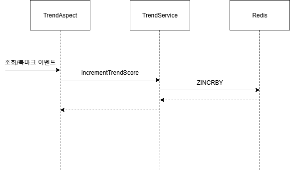
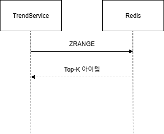

# 트렌드 기반 추천 - 1. 트렌드 수집 및 집계하기
## 배경
TOURIN은 사용자가 관심 있어할만한 관광지를 추천하는 기능이 있습니다 ([참조 - 요구사항 명세서](../기능적%20요구사항.md)). 여러가지 추천 모델을 고려했지만 그 중 cold-start 문제로부터 자유롭고 구현이 간단한 인기도 기반의 추천 모델을 구현했습니다. 이 문서를 포함한 후속 문서들에서는 현재 트렌드를 분석해 인기 있는 관광지를 찾아 사용자에게 추천하는 기능을 구현한 과정을 설명합니다.

## 인기 아이템 선정하기
인기도 기반의 추천 모델은 말그대로 인기가 있는 아이템을 선정해 사용자에게 추천하는 모델입니다. 따라서 아이템 선정을 위해서는 먼저 "인기 있는 아이템"이 무엇인지 정의할 필요가 있습니다.

인기도 기반의 추천 모델을 사용하는 다른 서비스를 참고하면 힌트를 얻을 수 있습니다. Instargram, Youtube 같은 SNS 서비스에서는 인기도 산정을 위해 조회 수, 좋아요 수 등의 정보를 사용합니다. 아무래도 사용자가 조회와 좋아요 등을 통해 관심을 많이 표현한 아이템은 인기 있는 아이템이라고 생각할 수 있을 것 같습니다. 마찬가지의 논리를 TOURIN에 적용했습니다. TOURIN 사용자는 관광지를 조회하고, 관심이 있는 경우 북마크를 하기 때문에 이를 이용해 인기도를 산정할 수 있습니다. 결과적으로 관광지 인기도를 아래의 공식과 같이 정의했습니다.

```
인기도 = 조회 수 + 2 * 북마크 수
```

조회 수와 북마크 수의 가중합을 인기도로 정의했습니다. 아무래도 단순 조회보다는 북마크를 했다는 것이 사용자의 관심을 더 많이 끈 것이라고 생각해 북마크 수에 더 큰 가중치를 부여했습니다.

위와 같이 인기도 점수를 정의하면 그것을 기준으로 관광지들을 정렬할 수 있습니다. 거기서 상위 K개의 관광지를 뽑아 사용자에게 제공하면 인기도 기반의 추천 기능을 구현할 수 있습니다.

## 트렌드 수집, 저장, 집계하기
### 트렌드 수집
트렌드를 분석하기 위해서는 먼저 트렌드 관련 데이터를 수집해야만 합니다. 인기도를 정의했으니 수집 대상과 수집 방식을 정할 수 있습니다. 인기도 산정을 위해 필요한 것은 조회 수와 북마크 수이기 때문에 관련 요청 이벤트를 감지하면 됩니다.

이벤트 수집 방식은 크게 2가지 방식을 고려했습니다.

1. **클라이언트에서 수집**: 클라이언트에서 이벤트를 감지해 서버에 이벤트 발생을 고지
2. **서버에서 수집**: 서버에 들어오는 요청을 기반으로 이벤트를 감지

전자는 사용자가 앱과 상호작용한대로 이벤트를 정확히 수집할 수 있지만, 클라이언트와 서버에 이벤트 감지와 수집을 위한 코드가 추가되어야합니다. 후자는 전자에 비해 이벤트 수집의 정확성이 떨어지지만, 서버에만 기능을 추가하면 되기 때문에 훨씬 간단합니다. 각각의 이벤트 발생을 감지할 수 있는 API(`GET /api/tour-spots/{tourSpotId}`, `POST /api/users/{userId}/bookmarks`)가 명확히 존재했기 때문에 구현이 더 간단합니다. Controller에 Spring AOP를 적용하면 이벤트를 쉽게 수집할 수 있습니다. 아래는 이벤트 수집을 수행하는 `TrendAspect`입니다.

```java
@Aspect
@Component
@RequiredArgsConstructor
public class TrendAspect {
    private final TrendService trendService;
    public static final int VISIT_SCORE = 1;
    public static final int BOOKMARK_SCORE = 2;

    @AfterReturning(
            pointcut = "execution(* com.positivewand.tourin.web.tourspot.TourSpotController.getTourSpot(..))",
            returning = "returnVal"
    )
    public void collectVisitTrend(JoinPoint join, TourSpotResponse returnVal) throws Throwable {
        // 조회 이벤트 수집...
    }

    @AfterReturning(
            pointcut = "execution(* com.positivewand.tourin.web.user.UserController.addUserBookmark(..))",
            returning = "returnVal"
    )
    public void collectBookmarkTrend(JoinPoint join, BookmarkResponse returnVal) throws Throwable {
        // 북마크 이벤트 수집...
    }
}
```

`@AfterReturning` 어드바이스로 성공한 조회/북마크 요청을 감지해 트렌드를 수집합니다. Controller나 Service에 트렌드 수집 관련 코드를 추가해도 되지만, 트렌드 수집과 관련된 코드가 다른 영역들에 침투하는 것이 코드의 응집성을 저해한다고 생각해 Spring AOP를 이용했습니다.

### 트렌드 저장 및 집계
트렌드 관련 데이터를 수집한 후에는 저장 및 집계가 이뤄져야합니다. 그리고 이를 위한 솔루션으로 Redis를 도입했습니다. 그 이유는 아래와 같습니다.

- **성능**: Redis는 메모리 기반의 DB이기 때문에 빠른 읽기/쓰기 성능을 보장합니다.
- **다양한 자료구조 지원**: Redis에서는 다양한 자료구조(List, Set, Sorted Set, Hash 등)를 지원합니다. 특히 Sorted Set는 인기도 기반 추천에 활용할 수 있습니다.
- **분산 및 확장성**: Redis는 싱글 쓰레드이기 동시 요청에도 데이터 일관성이 깨지지 않습니다.

Redis의 Sorted Set을 사용하면 수집된 트렌드를 쉽게 집계하고 Top-K 아이템을 빠르게 조회할 수 있습니다. 따라서 이를 활용해 추천 기능을 아래와 같이 구현했습니다.

1. **트렌드 수집 및 저장**: Spring AOP를 통해 수집된 이벤트는 Redis Sorted Set에 저장된 아이템의 점수를 갱신합니다. 결과적으로 인기도 점수를 기준으로 관광지가 정렬된 Sorted Set이 유지됩니다.
2. **트렌드 조회**: Sorted Set에 저장된 인기도가 높은 Top-K 아이템을 `ZRANGE` 명령으로 조회합니다. 조회 비용은 `O(log(I) + K)` 입니다.
   - `I`: 총 아이템 개수
   - `K`: 추천할 아이템 개수

## 구현 결과
아래는 지금까지 구현한 추천 시스템의 시퀀스 다이어그램입니다.
### 트렌드 수집 및 저장


관광지에 대한 조회/북마크 이벤트 발생을 AOP로 수집하고 이벤트 종류에 따라 관광지 인기도가 오릅니다. 관광지와 그것의 인기도는 Redis의 Sorted Set에 저장 및 관리됩니다.

### 트렌드 조회


인기도 Top-K 관광지는 Redis Sorted Set의 `ZRANGE` 명령으로 조회합니다.

## 한계
Spring AOP와 Redis를 이용해 트렌드를 수집하고 인기도를 계산해 관광지를 추천하는 시스템을 구현할 수 있었습니다. 사용자는 수많은 관광지를 직접 하나씩 찾는 대신 인기 있는 관광지를 추려서 추천 받을 수 있게 됐습니다. 하지만 지금까지 구현한 결과물은 몇가지 문제점이 있습니다.

1. **트렌드 어뷰징 가능**: 트렌드 수집 시스템이 충분히 정교하지 않기 때문에 관광지 트렌드가 쉽게 조작될 수 있습니다. 누군가 의도적으로 요청을 많이 보내는 경우 추천 품질이 떨어질 수 있습니다.
2. **트렌드 시의성 부족**: 지금까지 구현된 시스템은 트렌드를 수집하기 시작한 시점부터 데이터가 누적됩니다. 인기도 점수는 계속해서 단순 누적되기 때문에 일시적인 트렌드를 포착하기가 어렵습니다. "트렌드"라는 말을 사용하기 무색합니다.

앞으로 위 문제들을 하나씩 해결해보도록 하겠습니다.