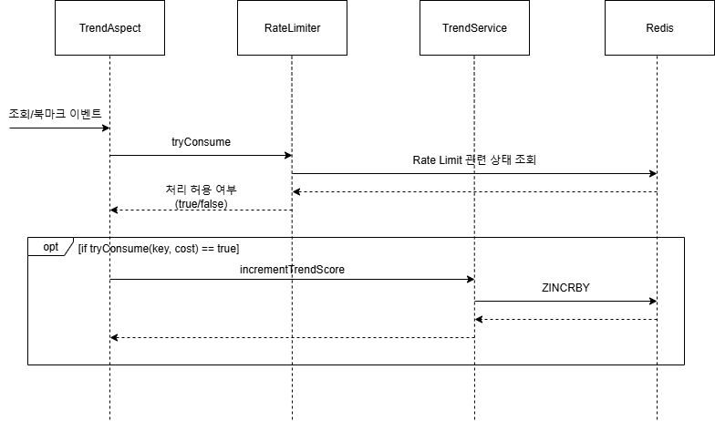

# 트렌드 기반 추천 - 2. 트렌드 어뷰징 방지하기
## 배경
*이 문서는 [트렌드 기반 추천 - 1. 트렌드 수집 및 집계하기](./트렌드%20기반%20추천%20-%201.%20트렌드%20수집%20및%20집계하기.md)의 후속 문서입니다.*

이전 글에서 트렌드 관련 이벤트를 수집해 인기도를 계산하고 인기 있는 아이템을 선정하는 기능을 만들었습니다. 하지만 트렌드를 수집하는 기능이 충분히 정교하지 않아 트렌드 조작에 취약합니다. 이번 글에서는 기존의 시스템을 Rate Limiting으로 어뷰징을 방지하고 트렌드가 정확히 수집될 수 있도록 보완한 과정을 설명합니다.

## 트렌드 어뷰징 발생 원리 및 방지 필요성
트렌드 수집을 담당하는 `TrendAspect`에서는 모든 성공한 요청을 관광지 인기도에 반영합니다. 이 구현에서는 모든 요청이 서비스를 사용하면서 생기는 관광지에 대한 순수한 관심에 의한 것이라고 가정하고 있습니다. 하지만 현실은 그리 단순하지 않습니다. 누군가 악의적으로 혹은 의도치 않게 트렌드를 조작할 수 있습니다.

요즘에는 많이 없어졌지만 옛날에는 게시판 서비스의 게시물 조회 수를 새로고침으로 조작할 수 있는 경우가 많았습니다. 이와 같이 조작된 조회 수를 기반으로 인기도를 측정한다면 트렌드가 부정확하게 분석될 가능성이 높습니다. 일종의 어뷰징인 셈입니다. TOURIN의 트렌드 기반 추천 기능도 마찬가지로 시스템 어뷰징으로 조작될 수 있습니다. 이는 기능의 목적(사용자가 관심을 끌만한 관광지가 추천)이 실현되는 것을 방해합니다. 따라서 정확한 트렌드 포착을 위해서는 모든 조회/북마크 요청을 인기도에 반영할 것이 아니라 적절히 선별해서 반영할 필요가 있습니다.

## 트렌드 어뷰징 방지하기
Rate Limiting으로 어뷰징을 방지할 수 있습니다. 사용자가 트렌드 분석에 미칠 수 있는 영향을 제한해 특정 사용자가 아닌 전체 사용자들의 트렌드를 포착하도록 하는 겁니다. Rate Limiting은 DDoS 공격 방지, 과도한 비용 발생 방지를 위해 보통 사용됩니다. 하지만 이와 같이 트렌드를 정확하게 포착하기 위한 표본 추출에도 활용할 수 있습니다.

Rate Limiting을 구현하기 위해 먼저 제한의 기준이 되는 키를 정의했습니다. 그리고 Redis를 이용한 Rate Limit 기능을 구현하고 관련 논리를 인터페이스로 추상화했습니다.

### Rate Limiting 키
Rate Limiting은 키를 기준으로 이뤄집니다. 키를 이용해 처리 한계가 초과됐는지 판단합니다. 특정 사용자가 트렌드에 과도한 영향을 주는 것을 막아야하기 때문에 키에는 사용자 식별 정보가 포함되어야 합니다. 하지만 로그인된 사용자와 달리 로그인되지 않은 익명의 사용자는 명확한 식별자가 존재하지 않는다는 문제가 있습니다. 이 경우 사용자를 정확히 식별하지는 못하지만 IP 주소를 이용해 식별할 수 있습니다.

그리고 키에는 관광지 ID도 넣어주었습니다. 사용자가 특정 관광지에 미치는 영향을 제한해야하지 사용자 자체의 영향력을 과도하게 제한하고 싶지는 않았기 때문입니다. 결과적으로 **Rate Limiting 키는 사용자 식별자와 관광지 ID가 조합된 튜플**로 정의했습니다. 이는 `TrendAspect`의 `getRateLimitKey` 메소드에서 확인하실 수 있습니다.

```java
public class TrendAspect {
    ...
    private String getRateLimitKey(String clientId, long tourSpotId) {
        return clientId + ":" + tourSpotId;
    }
}
```

### `RateLimiter` 인터페이스
Rate Limiting은 활용 범위가 넓고 다양한 정책이 적용될 수 있다고 생각합니다. 따라서 Rate Limiting 관련 논리를 `RateLimiter` 인터페이스로 추상화했습니다. 이것으로 Rate Limiting을 필요로 하는 곳에서는 구체적인 클래스가 아닌 인터페이스에 의존하기 때문에 추후 쉽게 정책을 바꿀 수 있습니다.

```java
public interface RateLimiter {
    boolean tryConsume(String key, int cost);
}
```

Rate Limiting 서비스를 사용하고자 하는 클래스에서는 아래와 같이 `tryConsume` 메소드를 이용해 요청이 허용되는지 확인할 수 있습니다.

```java
if (rateLimiter.tryConsume(aKey, aCost))
    // 요청 처리...
else
    // 요청 무시...
```

### Redis를 활용한 Rate Limit
Redis는 접근 속도가 빠르고, 싱글 쓰레드이기에 확장에도 유리합니다. 따라서 Rate Limit 관련 상태를 저장하는 저장소로 Redis를 선택했습니다. TTL 기능을 활용해 시간 기반의 Rate Limit 정책을 구현하기가 쉬운 건 덤입니다.

트렌드 관련 Rate Limit 정책을 구현한 `TrendRateLimiter` 클래스는 아래와 같습니다.

```java
public class TrendRateLimiter implements RateLimiter {
    ...

    @Override
    public boolean tryConsume(String key, int cost) {
        return Boolean.TRUE.equals(rateLimiterOps.opsForValue().setIfAbsent(
                getBucketKey(key),
                "1",
                Duration.between(
                        LocalDateTime.now(),
                        LocalDate.now().plusDays(1).atStartOfDay()
                )
        ));
    }

    ...
}
```

Redis의 `SET` 명령과 TTL 기능을 활용해서 사용자ID-관광지ID 튜플은 하루에 한 번만 트렌드 점수에 영향을 줄 수 있도록 구현했습니다. 또한 `SET` 명령의 `NX` 옵션을 사용했기 때문에 동시성 문제로부터 자유롭습니다.

\+추가) 다시보니 트렌드에 주는 영향을 과도하게 제한하는 정책인 것 같습니다. 이는 추후 수정해야겠습니다.

## 구현 결과
### 트렌드 수집 및 저장


이전 구현에서 `RateLimiter`가 추가됐습니다. `RateLimiter`에서 허용하는 이벤트만이 트렌드 분석에 활용될 수 있습니다.

### 트렌드 조회


트렌드를 조회하는 부분에서는 변한 것이 없습니다.

## 한계
어뷰징으로 인한 트렌드 조작을 Rate Limit으로 방지했지만 여전히 남아있는 문제가 있습니다. 추천되는 아이템의 시의성이 부족합니다. 인기도가 수집되기 시작할 때부터 인기도 점수가 계속해서 누적되기 때문에 특정 날짜, 시간대에 발생한 트렌드를 포착하지 못합니다. 다음 글에서는 이 문제를 해결해보도록 하겠습니다.

## 참조
- [System Design Interview - 5. Design A Rate Limiter](https://bytebytego.com/courses/system-design-interview/design-a-rate-limiter)