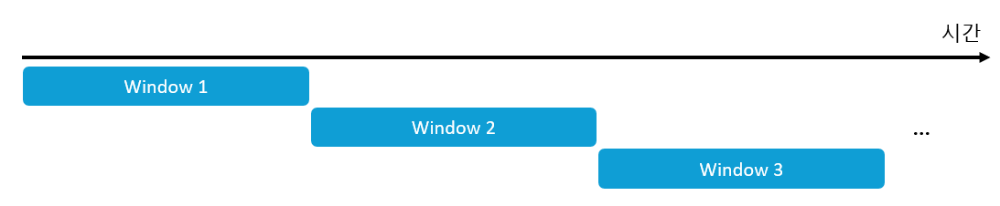
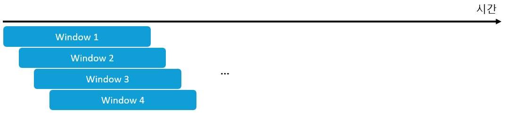
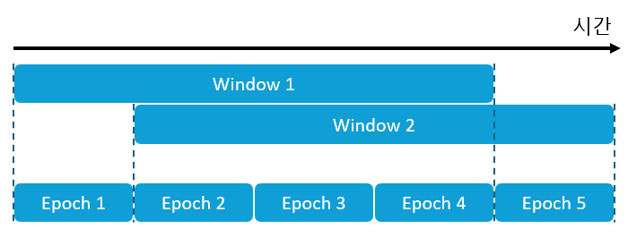
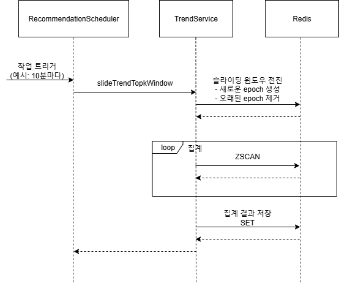
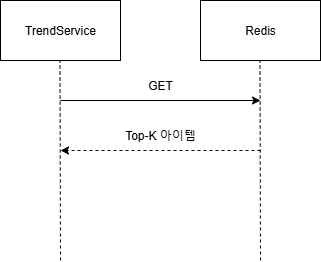

# 트렌드 추천 - 3. 트렌드 시의성 개선하기
## 배경
*이 문서는 [트렌드 기반 추천 - 1. 트렌드 수집 및 집계하기](./트렌드%20기반%20추천%20-%201.%20트렌드%20수집%20및%20집계하기.md), [트렌드 기반 추천 - 2. 트렌드 어뷰징 방지하기](./트렌드%20기반%20추천%20-%202.%20트렌드%20어뷰징%20방지하기.md)의 후속 문서입니다.*

조회/북마크 이벤트로부터 인기도 점수를 계속해서 누적시키는 방식은 안 좋은 추천 품질로 이어질 가능성이 큽니다. 어느 순간부터 인기도 순위가 변하지 않아 정체될 가능성이 높고, 결과적으로 사용자들이 관심이 생길만한 일시적 트렌드를 정확히 포착하지 못하게 됩니다. 따라서 단순 누적 인기도를 더 정교하게 만들 필요가 있습니다.

긴 시간 누적된 인기도로 희미해진 트렌드는 윈도우 기법을 이용해 명확히 포착할 수 있습니다. 이 문서에서는 TOURIN에서 트렌드 포착을 위해 고려했던 대표적인 윈도우 기법들을 살펴보고, 그것을 어떻게 효율적으로 구현했는지에 대해서 살펴봅니다.

## 윈도우 기법을 활용한 시의성 개선
이벤트 스트림에서 트렌드를 포착하기 위해서는 시간적으로 가까운 이벤트들을 모아서 분석합니다. 이런 분석을 돕는 대표적인 방법이 윈도우 기법입니다. 윈도우 기법은 전체 데이터가 아닌 윈도우 내의 데이터만을 처리하기 때문에 일시적인 트렌드 포착에 유리합니다.

스트림에서의 고정 크기 윈도우 기법은 크게 2가지가 있습니다. Tumbling Window와 Sliding Window입니다.

### Tumbling Window


텀플링 윈도우는 시간 축을 겹치지 않는 고정 길이의 시간 구간으로 나누고 구간별로 계산을 수행합니다. 구간끼리 겹치지 않고 명확히 구분되기 때문에 구현이 단순하고 성능 부담이 적습니다. 하지만 윈도우가 서로 겹치지 않기 때문에 정교한 분석이 어렵습니다. 사전 정의된 구간이 조정될 수 없기 때문에 윈도우 경계에서 발생하는 트렌드를 포착하기가 어렵습니다.

### Sliding Window


슬라이딩 윈도우는 윈도우가 고정 크기를 갖지만 시간 축 내 임의의 위치에 존재할 수 있습니다. 따라서 텀블링 윈도우와는 다르게 정교한 분석이 가능하지만, 그만큼 구현이 복잡하고 성능 부담도 큽니다.

## 그래서 어떤 기법을 선택?
더 정확한 트렌드 포착을 위해서는 Sliding Window의 구현이 필요해 보입니다. 하지만 성능적인 부분이 걸리기 때문에 TOURIN에서는 정확한 분석을 일부 포기하고 성능을 향상시킨 Sliding Window를 구현했습니다. 결과적으로 Tumbling Window와 Sliding Window의 장점을 모두 취한 결과물이 나오게 됐습니다.

## Sliding Window 구현
### Sliding Window 단순 구현
Redis의 Sorted Set을 이용해 Sliding Window를 쉽게 구현할 수 있습니다. 이벤트 로그를 Sorted Set에 저장해 트렌드 관광지 조회 요청이 발생할 때마다 집계를 수행하면 됩니다. 조회 시에 현재 시점을 기준으로 윈도우 집계를 수행하고 집계 결과를 토대로 사용자에게 관광지를 추천할 수 있습니다. 이런 구현은 아래와 같은 시간복잡도/공간복잡도를 갖습니다.

- **트렌드 수집 및 저장**
  - 시간복잡도: `O(logL)`
  - 공간복잡도: `O(L)`
- **트렌드 조회**
  - 시간복잡도: `O(L)`

\* 참고: `L` = 이벤트 개수

`L`이 작은 경우 상관이 없지만, 이벤트가 많이 발생할 수 있다는 것을 생각하면 `L`에 비례한 저장 공간 차지와 계산 시간은 바람직해보이지 않습니다.

### 효율적인 Sliding Window - 실시간 집계 대신 일괄 집계
조회 요청이 있을 때마다 데이터를 집계하는 것은 비효율적입니다. 트렌드는 초단위 수준에서는 거의 변하지 않고 사용자들도 그만큼의 미세한 변화를 궁금해하지는 않을 것 같습니다. 따라서 실시간 집계보다는 일정 주기마다 일괄적으로 집계하는 방식이 더 효율적이라고 판단했습니다. 이를 epoch 기반의 Sliding Window로 구현했습니다.



epoch 기반의 Sliding Window는 윈도우를 epoch라는 소단위로 분할해 집계를 빠르게 수행합니다. 일정 시간이 지나 윈도우가 전진하면서 새로운 epoch이 생성되고, 오래된 epoch는 윈도우에서 제거됩니다. 이 방식은 조회 때마다 집계를 수행하지 않고, 윈도우가 전진할 때만 집계를 수행하기 때문에 효율적입니다. 구현한 코드는 아래와 같습니다.

```java
public class TrendService {
    private final RedisOperations<String, String> redisOps;
    private final ObjectMapper objectMapper;

    ...

    public void slideTrendTopkWindow() throws JsonProcessingException {
        // current epoch에 epoch id 부여
        String lastEpochKey = redisOps.opsForList().getLast(TREND_TOPK_WINDOW);
        String newEpochKey = getNewEpochKey(lastEpochKey);

        // 새로운 epoch를 sliding window에 삽입
        redisOps.rename(TREND_TOPK_WINDOW_CURRENT_EPOCH, newEpochKey);
        redisOps.opsForList().rightPush(TREND_TOPK_WINDOW, newEpochKey);

        // 오래된 epoch을 sliding window에서 제거
        List<String> oldEpochKeys = redisOps.opsForList().range(TREND_TOPK_WINDOW, 0, -(WINDOW_SIZE+1));
        redisOps.delete(oldEpochKeys);
        redisOps.opsForList().trim(TREND_TOPK_WINDOW, -WINDOW_SIZE,-1);

        // window 집계
        aggregateAndStoreWindow();
    }

    public void aggregateAndStoreWindow() throws JsonProcessingException {
        List<TrendItem> topkIds = aggregateWindow();
        redisOps.opsForValue().set(TREND_TOPK, objectMapper.writeValueAsString(topkIds));
    }

    public List<TrendItem> aggregateWindow() {
        Map<Long, Double> score = new HashMap<>();
        
        // window를 구성하고 있는 epoch들을 집계
        List<String> epochList = redisOps.opsForList().range(TREND_TOPK_WINDOW, 0, -1);
        for (String epochKey: epochList) {
            ScanOptions options = ScanOptions.scanOptions().build();
            try (Cursor<ZSetOperations.TypedTuple<String>> cursor = redisOps.opsForZSet().scan(epochKey, options);) {
                while (cursor.hasNext()) {
                    ZSetOperations.TypedTuple<String> tuple = cursor.next();
                    long tourSpotId = Long.parseLong(tuple.getValue());

                    if (!score.containsKey(tourSpotId))
                        score.put(tourSpotId, 0.);

                    score.put(tourSpotId, score.get(tourSpotId) + tuple.getScore());
                }
            }
        }

        List<TrendItem> items = new ArrayList<>(score.entrySet()
                .stream()
                .map(entry -> new TrendItem(entry.getKey(), entry.getValue()))
                .toList()
        );
        items.sort(Comparator.reverseOrder());

        return items;
    }
}
```

위 구현은 수평 확장을 고려하기도 했습니다. 트렌드 관련 데이터가 사전 합의된 현재 epoch 키(`TREND_TOP_K_WINDOW_CURRENT_EPOCH`)에 기록되기 때문에 여러 노드들로부터 트렌드 관련 데이터를 수집하더라도 키 이름에 대한 특별한 합의가 필요하지 않습니다. 합의를 하면서 발생하는 동시성 문제가 없습니다. 단, 윈도우를 전진시키고 결과를 집계하는 작업을 단일 노드가 담당해야만 동시성 문제가 발생하지 않습니다. 결과적으로 epoch 기반의 슬라이딩 윈도우는 아래와 같은 시간복잡도/공간복잡도를 갖습니다.

- **트렌드 수집 및 저장**
  - 시간복잡도: `O(logI)`
  - 공간복잡도: `O(I)`
- **트렌드 일괄 갱신**
  - 시간복잡도: `O(I)`
- **트렌드 조회**
  - 시간복잡도: `O(I)`

\* 참고: `I` = 아이템(관광지) 개수

`L(로그 개수)`보다 `I(아이템 개수)`는 작은 확률이 큽니다. 따라서 epoch 기반의 슬라이딩 윈도우는 나이브하게 구현한 슬라이딩 윈도우와 비교했을 때 더 효율적입니다.

## 구현 결과
### 트렌드 수집 및 저장


트렌드를 수집 및 저장하는 부분은 전역 윈도우를 집계한 Sorted Set 대신 `TREND_TOP_K_WINDOW_CURRENT_EPOCH` Sorted Set에 인기도 점수를 저장합니다.

### 트렌드 일괄 갱신


트렌드 관광지를 주기적으로 일괄 갱신하는 작업이 추가됐습니다. 아래와 같은 과정으로 트렌드 아이템이 집계됩니다.

1. **일정 주기마다 슬라이딩 윈도우 전진 작업 실행**
   - 설정한 주기마다 작업 실행
   - 윈도우 크기 = epoch 개수 * epoch 크기
   - epoch 크기 = 전진 작업 실행 주기
2. **슬라이딩 윈도우 전진**
   - 새로운 epoch 생성
   - 오래된 epoch 제거
3. **윈도우 집계**
   - 갱신된 슬라이딩 윈도우를 집계
   - epoch 별로 `ZSCAN` 명령을 실행하여 윈도우 내 관광지별 인기도 집계
4. **집계 결과 저장**
   - 집계된 인기도로 정렬된 관광지들을 Redis 저장소에 저장

### 트렌드 조회


트렌드를 조회하는 부분은 이제 Sorted Set으로부터 Top-K 아이템을 조회하지 않고 슬라이딩 윈도우가 전진하면서 집계한 결과를 바로 가져옵니다.

## 향후 계획
처음에는 단순히 트렌드 이벤트를 수집해 인기도를 계산하고, 인기 있는 관광지를 사용자에게 추천하는 기능이었지만 1) Rate Limiter, 2) Sliding Window를 도입해 더 정확하게 트렌드를 포착하도록 보완할 수 있었습니다. 그런 과정 중에 트렌드를 분석하고 추천하는 기능을 별도의 앱으로 분리할 수 있겠다는 생각이 들었습니다. 별도의 앱으로 분리하면 여러 방면에서 유연한 구조가 갖춰집니다. 비동기 큐를 도입하고 추천 도메인을 별도의 앱으로 분리하는 MSA 아키텍처로 발전시켜보면 좋을 것 같습니다.

## 참조
- [Realtime Trending Analysis with Approximate Algorithms](https://pkghosh.wordpress.com/2014/09/10/realtime-trending-analysis-with-approximate-algorithms/)